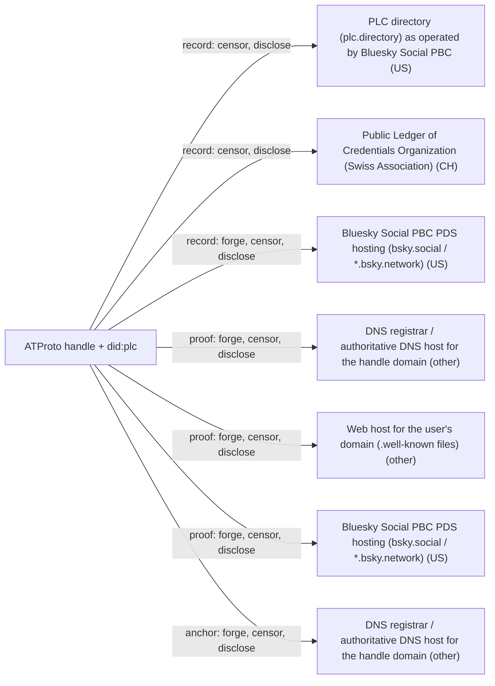

# ATProto handle + did:plc

## C1. Proof mechanism

The proof is bidirectional and public. The DID doc lists at://<handle> in alsoKnownAs, and the domain names the DID through DNS TXT _atproto.<handle> or https://<handle>/.well-known/atproto-did (https://atproto.com/specs/handle). For did:plc the alsoKnownAs entry sits inside a rotation-key-signed PLC operation (https://web.plc.directory/spec/v0.1/did-plc). No third party signs the binding.

## C2. Verifier independence

Verifiers resolve both directions live. Handles 'should not be trusted' until the DID doc links back (https://atproto.com/specs/handle). did:plc requires the PLC directory or a replica. Validating read replicas are open source and community mirrors exist (https://atproto.com/blog/plc-replicas), but most clients hit plc.directory, still run by Bluesky PBC.

## C3. Platform coverage and fragility

The only anchor is DNS or HTTPS on a domain, so there is no platform API to close and anything a registrar and web host serve works. The flip side is that users without a domain get a subdomain of their PDS operator (e.g. *.bsky.social), where that operator controls both sides of the link.

## C4. Key lifecycle

did:plc has 1-5 priority-ordered rotation keys (secp256k1 or P-256). A higher-priority key can undo operations by lower keys within 72 hours (https://web.plc.directory/spec/v0.1/did-plc). The handle binds to the DID, so key rotation never breaks it. By default the PDS holds the rotation keys, and users must add their own recovery key manually (https://whtwnd.com/bnewbold.net/3lj7jmt2ct72r). did:web has no recovery or migration (https://atproto.com/specs/did).

## C5. Freshness and replay

Freshness comes from live resolution, not timestamps on the proof. If a domain changes owner, the old DID's claim fails the backlink and shows as handle.invalid. PLC operations are hash-chained and timestamped, and the full history is public via /log/audit and /export, but it is not yet a Merkle transparency log (https://dholms.leaflet.pub/3m6zswymcqk2p).

## C6. Threat model

The PLC directory cannot forge operations but can reject or remove accepted ones, so it must be trusted to keep the set of valid operations (https://dholms.leaflet.pub/3m6zswymcqk2p). The main forgery risks are the DNS registrar or host, which can repoint the domain to another DID, and the PDS, which by default holds the rotation keys and can rewrite the DID doc. Handle history in alsoKnownAs stays public forever (https://web.plc.directory/spec/v0.1/did-plc).

## C7. Key system portability

It works only with atproto DIDs (did:plc and did:web), and keys must be secp256k1 or P-256. Ed25519 and other DID methods are explicitly out of scope (https://atproto.com/specs/did).

## C8. Adoption and status

The offering is in heavy production use: more than 40M PLC identifiers (https://web.plc.directory/) and more than 270k domain handles as of April 2025 (https://bsky.social/about/blog/04-21-2025-verification). An IETF ATP WG was chartered in March 2026 and covers identifier resolution requirements (https://atproto.com/blog/kicking-off-the-atp-working-group). Handle and PLC specs are still published by Bluesky and PLC.

## C9. Effort tier

This is the migrate tier: you must hold an atproto identity. Within atproto, adding a domain handle is cheap (one DNS TXT record).

## C10. Sovereignty

The record lives in the PLC directory, still run by Bluesky PBC (US). The Swiss PLC Organization formally exists, but its next step is 'to get ready to take over the PLC directory assets and operations', so the transfer is NOT complete as of 2026-09-28 (https://blog.plcred.org/3mwlphq42d227). Only one authoritative writer exists. Community proposals for federated or BFT directories remain open (https://github.com/bluesky-social/atproto/discussions/4002), and as of Sept 2025 there were only about 3 public mirrors (https://updates.microcosm.blue/3lz7nwvh4zc2u).

## Misfit notes

It fits bidirectional public proof, with three twists. (1) One direction (DID to handle) is stored in a registry log rather than published by the key holder on a host it controls. (2) The anchor is the identity's primary name, not a secondary linked account. The domain IS the username, so the offering merges naming with anchoring and supports only one anchor at a time (the first valid alsoKnownAs). (3) For default users the custodial PDS holds the signing and rotation keys and also controls the *.bsky.social subdomain, so both ends of the 'bidirectional' proof sit with one operator, which collapses it into a platform assertion. It cannot be attached to an existing key system, so it is migrate tier only. did:web is a partial build or self-host path but loses recovery.

## Surprises

The PLC directory transfer to the Swiss association is still not done a year after the Sept 2025 announcement: the org was formally set up only in Sept 2026 (https://blog.plcred.org/3mwlphq42d227). Most users' DID rotation keys are held by their PDS (Bluesky), not by the user. Ed25519 is not supported. The PLC 'ledger' is not yet a transparency log, and the directory can silently drop accepted operations. Domain handles (more than 270k accounts) are explicitly NOT the blue check. Old handles stay in the public PLC audit log forever.

## Facts

| Fact | Value | Source | Date | Note |
|---|---|---|---|---|
| `proof.key_signs_claim` | yes | [link](https://web.plc.directory/spec/v0.1/did-plc) | 2025-12 | For did:plc (the deployed default) the at://handle entry in alsoKnownAs is part of a PLC operation signed by a rotation key. For did:web the DID doc is a plain HTTPS file and is not signed. |
| `proof.anchor_publishes_key` | yes | [link](https://atproto.com/specs/handle) | 2026 | The domain publishes the DID in DNS TXT _atproto.<handle> (did=...) or at https://<handle>/.well-known/atproto-did. |
| `proof.third_party_signs_binding` | no | [link](https://web.plc.directory/spec/v0.1/did-plc) | 2025-12 | The PLC directory validates and orders operations but does not sign them; only rotation keys sign. No third-party attestation is involved. |
| `proof.uses_oauth_oidc` | no | [link](https://atproto.com/specs/handle) | 2026 | The link is made by editing DNS or a well-known file and updating the DID doc. No OAuth login to the domain is involved. |
| `proof.capability_delegation` | no | [link](https://atproto.com/specs/handle) | 2026 | This is a two-way claim of sameness (DID doc names the handle, domain names the DID). It does not delegate authority. |
| `proof.anchor_is_dns` | yes | [link](https://atproto.com/specs/handle) | 2026 | The handle is a DNS name, resolved via DNS TXT or HTTPS well-known. |
| `proof.anchor_is_email` | no | [link](https://atproto.com/specs/handle) | 2026 | The only handle form is a DNS hostname. Email addresses are not handles. |
| `proof.anchor_is_social` | no | [link](https://atproto.com/specs/handle) | 2026 | Only domains are supported. A platform can act as an anchor only by giving out subdomains (as bsky.social does). |
| `verify.offline_possible` | no | [link](https://atproto.com/specs/handle) | 2026 | The spec requires live resolution of both handle to DID and DID to doc, and says handles must not be trusted until the DID doc is confirmed to link back. |
| `verify.fetches_anchor` | yes | [link](https://atproto.com/specs/handle) | 2026 | The verifier must query DNS or fetch https://<handle>/.well-known/atproto-did. |
| `verify.needs_issuer_trust` | no | [link](https://web.plc.directory/spec/v0.1/did-plc) | 2025-12 | There is no issuer. PLC operations are self-certifying through rotation-key signatures. |
| `verify.needs_registry` | yes | [link](https://web.plc.directory/spec/v0.1/did-plc) | 2025-12 | did:plc (the deployed default) must be resolved via the PLC directory or a replica. did:web avoids the registry but is a minority path. |
| `verify.no_author_service` | yes | [link](https://atproto.com/blog/plc-replicas) | 2026-02-18 | did:plc can be resolved from community mirrors or self-run validating replicas (open source, go-didplc), and did:web needs no Bluesky service at all. In practice most clients use plc.directory, which Bluesky PBC still runs. |
| `verify.breaks_if_api_closed` | no | [link](https://atproto.com/specs/handle) | 2026 | The anchor is DNS or HTTPS on the user's own domain, so there is no platform API to close. |
| `lifecycle.survives_key_rotation` | yes | [link](https://web.plc.directory/spec/v0.1/did-plc) | 2025-12 | The handle binds to the DID, not to a key. Rotation and signing keys can change through PLC operations without breaking the DNS record. |
| `lifecycle.explicit_revocation` | yes | [link](https://web.plc.directory/spec/v0.1/did-plc) | 2025-12 | A signed PLC operation can remove or replace alsoKnownAs, which ends the bidirectional link. Removing the DNS TXT also works. |
| `lifecycle.expiry` | no | [link](https://atproto.com/specs/handle) | 2026 | Handles do not expire by design. The spec only recommends periodic re-resolution of cached results. |
| `lifecycle.key_recovery` | yes | [link](https://web.plc.directory/spec/v0.1/did-plc) | 2025-12 | Rotation keys are listed in priority order (1-5 keys). A higher-priority key can override operations by lower keys within 72 hours. |
| `lifecycle.replay_protected` | yes | [link](https://atproto.com/specs/handle) | 2026 | Verification is a live two-way check. If the domain changes hands and the new owner repoints DNS, the old DID's claim fails and is shown as handle.invalid. PLC operations are also hash-chained with timestamps. |
| `record.transparency_log` | no | [link](https://dholms.leaflet.pub/3m6zswymcqk2p) | 2025 | PLC keeps a public audit log (/log/audit, /export), but it is not yet a Merkle transparency log, and the directory can drop accepted operations. A Sunlight-style tlog is planned (sequence numbers were added in Jan 2026). |
| `record.self_hosted_possible` | yes | [link](https://atproto.com/specs/did) | 2026 | With did:web plus your own domain, both the record and the proof are self-hosted. did:web gets no migration or recovery support, and did:plc cannot be self-hosted. |
| `record.multi_operator` | no | [link](https://updates.microcosm.blue/3lz7nwvh4zc2u) | 2025-09-19 | Only one authoritative PLC directory accepts writes. Mirrors and replicas are read-only copies, and in Sept 2025 only about 3 public mirrors existed. |
| `portability.generic_key` | no | [link](https://atproto.com/specs/did) | 2026 | Only did:plc and did:web are supported, and keys must be secp256k1 or P-256. Ed25519 and other DID methods are not accepted. |
| `portability.extensible_anchors` | no | [link](https://atproto.com/specs/handle) | 2026 | The only anchor type is a DNS hostname. Any other anchor would need a spec change. |
| `adoption.spec_maturity` | 1 | [link](https://atproto.com/blog/kicking-off-the-atp-working-group) | 2026-04-02 | An IETF ATP WG was chartered in March 2026, and its scope covers identifier resolution requirements and a registry of methods such as PLC and did:web. The handle and did:plc specs are still published by Bluesky and PLC, not as adopted drafts. |
| `adoption.active_2026` | yes | [link](https://atproto.com/blog/plc-replicas) | 2026-02-18 | PLC read replicas (Feb 2026), export API changes (Jan 2026), and the PLC Org setup (Sept 2026). |
| `adoption.client_display` | yes | [link](https://bsky.social/about/blog/04-21-2025-verification) | 2025-04-21 | The Bluesky app shows the domain handle as the username. Bluesky reports more than 270,000 domain-handle accounts as of April 2025. |
| `effort.attachable` | no | [link](https://atproto.com/specs/did) | 2026 | Requires an atproto DID (did:plc or did:web) with secp256k1 or P-256 keys. An existing PGP, nostr, or ed25519 identity cannot be attached. |
| `effort.requires_platform_migration` | yes | [link](https://atproto.com/specs/did) | 2026 | You must create an atproto identity (DID doc with #atproto key and at:// alsoKnownAs). |

## Sovereignty

## Operators

| Layer | Operator | Forge | Censor | Disclose | Note |
|---|---|---|---|---|---|
| record | PLC directory (plc.directory) as operated by Bluesky Social PBC (US) | no | yes | yes | Cannot forge signed operations, but can reject or remove valid ones. Holds request logs. The operation log itself is public. |
| record | Public Ledger of Credentials Organization (Swiss Association) (CH) | no | yes | yes | Same powers once it takes over. The transfer was not complete as of 2026-09-28. |
| record | Bluesky Social PBC PDS hosting (bsky.social / *.bsky.network) (US) | yes | yes | yes | By default holds the rotation keys and can sign PLC operations that change keys or alsoKnownAs, taking over the DID that the domain points at. Users can add a higher-priority key of their own to override within 72h. |
| proof | DNS registrar / authoritative DNS host for the handle domain (other) | yes | yes | yes | Can repoint _atproto TXT to an attacker DID whose doc claims the handle, and the verifier will accept it. |
| proof | Web host for the user's domain (.well-known files) (other) | yes | yes | yes | For the well-known method, the host can serve a different DID. |
| proof | Bluesky Social PBC PDS hosting (bsky.social / *.bsky.network) (US) | yes | yes | yes | Only for *.bsky.social handles, where Bluesky controls the subdomain resolution. |
| anchor | DNS registrar / authoritative DNS host for the handle domain (other) | yes | yes | yes | The registrar controls the domain itself (it can seize, transfer, or suspend it). |
