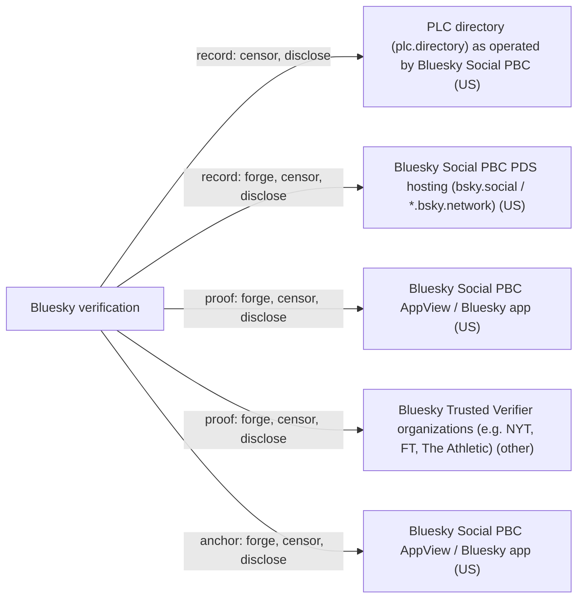

# Bluesky verification

## C1. Proof mechanism

This is issuer attestation. Bluesky (bsky.app) or a trusted-verifier org writes an app.bsky.graph.verification record {subject DID, handle, displayName, createdAt} into its own signed repo (https://github.com/bluesky-social/atproto/blob/main/lexicons/app/bsky/graph/verification.json, https://atproto.com/specs/repository). It does not link to any external account. It attests off-protocol that the account is 'authentic and notable', reviewed by Bluesky moderation (https://bsky.social/about/blog/04-21-2025-verification).

## C2. Verifier independence

A verification is valid only if issued by an account the app trusts, and only while the subject's current handle and displayName match the snapshot. The Bluesky AppView computes verifiedStatus, trustedVerifierStatus and isValid (https://github.com/bluesky-social/atproto/blob/main/lexicons/app/bsky/actor/defs.json). Any client can read the records, but the recognized trust list is Bluesky's.

## C3. Platform coverage and fragility

No external platforms are anchored, so there is no API fragility. Coverage is set by Bluesky's and the trusted verifiers' editorial choices (NYT, FT, The Athletic and others). Reviewers reportedly check for a link to the Bluesky account on the applicant's official site, but that check is off-protocol and leaves no record.

## C4. Key lifecycle

The record names the subject DID, so key rotation does not affect it, and account recovery is inherited from did:plc. Changing your handle or displayName silently invalidates the check until it is re-issued (https://github.com/bluesky-social/atproto/blob/main/lexicons/app/bsky/graph/verification.json). Revocation is deleting the record, or Bluesky marking a verifier invalid.

## C5. Freshness and replay

There is no expiry. Freshness comes from comparing the snapshot with current state and from records being live and deletable. Repos are mutable and deletions leave no tombstone (https://atproto.com/specs/repository), so past verifications are not auditable.

## C6. Threat model

The trust model is a CA hierarchy: Bluesky acts as root, with trusted verifiers as sub-CAs (https://github.com/bluesky-social/atproto/discussions/3785). Bluesky or any trusted verifier can, alone, mark any account verified, and Bluesky can strip any verifier. It protects against impersonation of notable entities, not against the platform.

## C7. Key system portability

Only atproto DIDs can be subjects. The lexicon is reusable, and Eurosky/mu runs a separate verifier network with the same record type (https://hello.mu.social/verification/, https://github.com/singi-labs/sifa-workspace/issues/258).

## C8. Adoption and status

Launched 2025-04-21 (https://bsky.social/about/blog/04-21-2025-verification) and shown in the main Bluesky app. It is a vendor lexicon outside the IETF ATP charter (https://atproto.com/blog/kicking-off-the-atp-working-group). In 2026 it was reused by Eurosky/mu, and Sifa proposes attributed display.

## C9. Effort tier

This is the migrate tier. You need an atproto account and must be approved by Bluesky or a trusted verifier. There is no build or attach path for outsiders, though anyone can issue unrecognized records with the same lexicon.

## C10. Sovereignty

Bluesky PBC (US) runs the root issuer account, the PDS hosting its records, the AppView that decides validity, and the trusted-verifier list. Trusted verifiers are third-party orgs in various jurisdictions. Identity records resolve through the PLC directory, still Bluesky-run as of 2026-09-28 (https://blog.plcred.org/3mwlphq42d227).

## Misfit notes

It sits in the issuer-attestation family but without OAuth: the issuer's check is editorial and off-protocol, so nothing is anchored to any external account or domain. The 'anchor' is effectively a real-world entity judged by Bluesky or a trusted verifier, which is outside the OOBTA definition. The verifier is both issuer and trust root, with a sub-CA delegation (trusted verifiers) configured in the AppView rather than as a protocol capability. The record format is open and reusable (Eurosky/mu), so the 'issuer set' is per-app policy rather than a property of the offering.

## Surprises

A Bluesky blue check does not link to any external account. It is an editorial attestation of 'authentic and notable', separate from domain handles. Changing your own handle or display name silently voids your check. Verification records are mutable repo entries with no tombstone, so past verifications cannot be audited. Validity is computed by Bluesky's AppView from a Bluesky-chosen list of trusted verifiers. As of 2026, Eurosky/mu reuses the same lexicon with its own verifier set, so 'verified' depends on which app you use.

## Facts

| Fact | Value | Source | Date | Note |
|---|---|---|---|---|
| `proof.key_signs_claim` | no | [link](https://github.com/bluesky-social/atproto/blob/main/lexicons/app/bsky/graph/verification.json) | 2025-04 | The record lives in the verifier's repo. The subject's key never signs anything. |
| `proof.anchor_publishes_key` | no | [link](https://github.com/bluesky-social/atproto/blob/main/lexicons/app/bsky/graph/verification.json) | 2025-04 | No external anchor publishes anything. The verifier's record names the subject DID, handle, and displayName. |
| `proof.third_party_signs_binding` | yes | [link](https://atproto.com/specs/repository) | 2026 | The verifier (Bluesky or a trusted-verifier org) writes the record into its own repo, and that repo commit is signed by the verifier's atproto signing key. |
| `proof.uses_oauth_oidc` | no | [link](https://bsky.social/about/blog/04-21-2025-verification) | 2025-04-21 | Verification is an editorial decision by Bluesky moderation or a trusted verifier org. No OAuth to an external account is involved. |
| `proof.capability_delegation` | no | [link](https://github.com/bluesky-social/atproto/blob/main/lexicons/app/bsky/graph/verification.json) | 2025-04 | The record is an attestation about a subject DID, not a delegation. Trusted-verifier status works like a CA hierarchy, but it is configured in the AppView rather than expressed as a capability. |
| `proof.anchor_is_dns` | no | [link](https://github.com/bluesky-social/atproto/blob/main/lexicons/app/bsky/graph/verification.json) | 2025-04 | The record snapshots the handle string, which may be a domain, but it attests to off-protocol authenticity and notability, not control of a domain. Bluesky says domain handles are 'different from a verification badge'. |
| `proof.anchor_is_email` | no | [link](https://github.com/bluesky-social/atproto/blob/main/lexicons/app/bsky/graph/verification.json) | 2025-04 | The record has no email field. |
| `proof.anchor_is_social` | no | [link](https://github.com/bluesky-social/atproto/blob/main/lexicons/app/bsky/graph/verification.json) | 2025-04 | The record has no field for an external account. It attests that the atproto account belongs to an authentic or notable entity. |
| `verify.offline_possible` | no | [link](https://github.com/bluesky-social/atproto/blob/main/lexicons/app/bsky/actor/defs.json) | 2025-04 | Validity requires the issuer to be trusted by the app and the current handle and displayName to match the record. Both need live state, and in the Bluesky app the AppView computes them. |
| `verify.fetches_anchor` | no | [link](https://github.com/bluesky-social/atproto/blob/main/lexicons/app/bsky/graph/verification.json) | 2025-04 | There is no external anchor to fetch. The verifier reads the issuer repo or the AppView. |
| `verify.needs_issuer_trust` | yes | [link](https://github.com/bluesky-social/atproto/blob/main/lexicons/app/bsky/graph/verification.json) | 2025-04 | Per the lexicon, verifications are valid only if issued by an account the app considers trusted. |
| `verify.needs_registry` | yes | [link](https://web.plc.directory/spec/v0.1/did-plc) | 2025-12 | Issuer and subject DIDs (mostly did:plc) must be resolved to check signatures and current handles. |
| `verify.no_author_service` | no | [link](https://github.com/bluesky-social/atproto/blob/main/lexicons/app/bsky/actor/defs.json) | 2025-04 | In practice validity (verifiedStatus, trustedVerifierStatus, isValid) is computed by the Bluesky AppView. The root issuer bsky.app and its records are on Bluesky infrastructure, and the trusted-verifier list is set by Bluesky. |
| `verify.breaks_if_api_closed` | no | [link](https://github.com/bluesky-social/atproto/blob/main/lexicons/app/bsky/graph/verification.json) | 2025-04 | There is no external anchor platform. Issuer records stay readable from PDS and relays even without Bluesky's AppView, though a client would need its own verifier list. |
| `lifecycle.survives_key_rotation` | yes | [link](https://github.com/bluesky-social/atproto/blob/main/lexicons/app/bsky/graph/verification.json) | 2025-04 | The record names the subject DID, not a key, so key rotation does not affect it. Changing the handle or displayName does invalidate it. |
| `lifecycle.explicit_revocation` | yes | [link](https://github.com/bluesky-social/atproto/blob/main/lexicons/app/bsky/actor/defs.json) | 2025-04 | Besides deleting the record, the AppView can mark a trusted verifier invalid (trustedVerifierStatus), which voids all of its verifications. Handle or displayName changes also invalidate automatically. |
| `lifecycle.expiry` | no | [link](https://github.com/bluesky-social/atproto/blob/main/lexicons/app/bsky/graph/verification.json) | 2025-04 | Only createdAt is stored. There is no expiry field. |
| `lifecycle.key_recovery` | yes | [link](https://web.plc.directory/spec/v0.1/did-plc) | 2025-12 | Inherited from did:plc rotation keys for the subject and issuer accounts. The verification feature itself defines no recovery. |
| `lifecycle.replay_protected` | yes | [link](https://github.com/bluesky-social/atproto/blob/main/lexicons/app/bsky/graph/verification.json) | 2025-04 | The record binds a DID plus a snapshot of the handle and displayName, and is valid only while both still match. The record is mutable and can be deleted live. |
| `record.transparency_log` | no | [link](https://atproto.com/specs/repository) | 2026 | Repos are mutable signed Merkle trees. Records can be deleted with no tombstone, and there is no append-only log. |
| `record.self_hosted_possible` | no | [link](https://bsky.social/about/blog/04-21-2025-verification) | 2025-04-21 | The proof must be issued by Bluesky or a Bluesky-approved trusted verifier from that verifier's repo. A user cannot self-issue a recognized check. |
| `record.multi_operator` | no | [link](https://github.com/bluesky-social/atproto/blob/main/lexicons/app/bsky/actor/defs.json) | 2025-04 | Records are relayed over the firehose, but recognized validity comes from one operator, the Bluesky AppView. Other networks such as Eurosky/mu run separate verifier sets. |
| `portability.generic_key` | no | [link](https://github.com/bluesky-social/atproto/blob/main/lexicons/app/bsky/graph/verification.json) | 2025-04 | The subject must be an atproto DID. |
| `portability.extensible_anchors` | no | [link](https://github.com/bluesky-social/atproto/blob/main/lexicons/app/bsky/graph/verification.json) | 2025-04 | No external anchors are defined. New trusted verifiers can be added without a spec change, but those are issuers, not anchors. |
| `adoption.spec_maturity` | 0 | [link](https://github.com/bluesky-social/atproto/blob/main/lexicons/app/bsky/graph/verification.json) | 2025-04 | This is a vendor lexicon (app.bsky.*), and the IETF ATP charter excludes app-specific schemas and the moderation system. |
| `adoption.active_2026` | yes | [link](https://github.com/singi-labs/sifa-workspace/issues/258) | 2026-07-13 | In 2026 Eurosky/mu reuses app.bsky.graph.verification with its own verifiers, and other apps (Sifa) are adding attributed display. |
| `adoption.client_display` | yes | [link](https://bsky.social/about/blog/04-21-2025-verification) | 2025-04-21 | The Bluesky app shows blue checks and scalloped trusted-verifier badges. Tapping a check shows the issuers. |
| `effort.attachable` | no | [link](https://bsky.social/about/blog/04-21-2025-verification) | 2025-04-21 | Only works for atproto accounts, verified by Bluesky or its trusted verifiers. |
| `effort.requires_platform_migration` | yes | [link](https://bsky.social/about/blog/04-21-2025-verification) | 2025-04-21 | Requires an atproto (Bluesky) account and approval by Bluesky or a trusted verifier. |

## Sovereignty

## Operators

| Layer | Operator | Forge | Censor | Disclose | Note |
|---|---|---|---|---|---|
| record | PLC directory (plc.directory) as operated by Bluesky Social PBC (US) | no | yes | yes | Issuer and subject DIDs resolve via PLC. |
| record | Bluesky Social PBC PDS hosting (bsky.social / *.bsky.network) (US) | yes | yes | yes | Hosts the bsky.app root-issuer repo and most subjects' repos. It can write verification records with the issuer's key. |
| proof | Bluesky Social PBC AppView / Bluesky app (US) | yes | yes | yes | The AppView decides who is a trusted verifier and computes isValid. Bluesky is also the root issuer and can verify anyone or void any verifier. |
| proof | Bluesky Trusted Verifier organizations (e.g. NYT, FT, The Athletic) (other) | yes | yes | yes | Each trusted verifier can, alone, issue a recognized check for any account and delete it at will. |
| anchor | Bluesky Social PBC AppView / Bluesky app (US) | yes | yes | yes | There is no external anchor account. The attested real-world identity is judged off-protocol by Bluesky moderation, which reviews all verifications. |
