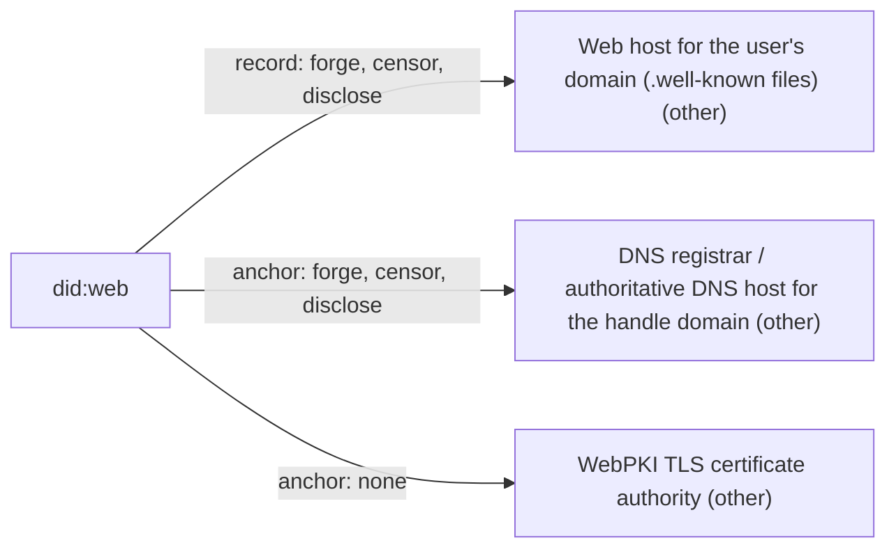

# did:web

## C1. Proof mechanism

did:web does not anchor a key to a domain; it makes the domain the identity. did:web:example.com resolves to https://example.com/.well-known/did.json, and whatever keys that file lists are the DID's keys (https://w3c-ccg.github.io/did-method-web/). The document is unsigned; HTTPS is the only authentication.

## C2. Verifier independence

Every verification fetches did.json over HTTPS, trusting DNS and the WebPKI; the spec recommends DNSSEC and DoH and warns that the web host and DNS provider can track resolutions.

## C3. Platform coverage and fragility

Only domains, including path-based identifiers on shared hosts, where the host operator is the real controller. Fragility is that of DNS registration and web hosting.

## C4. Key lifecycle

Rotation is trivial (edit did.json) and the DID persists; deactivation is deleting the file. There is no history, so past key states cannot be verified.

## C5. Freshness and replay

No timestamps, versions or log; when a domain lapses and is re-registered, the new owner fully inherits the DID. Hashlinks are mentioned only as optional integrity aids.

## C6. Threat model

Whoever controls the web server, DNS or registrar, or can MITM DNS, controls the identity. No signature by a prior key is required to change keys.

## C7. Key system portability

Any verification method type can be listed, so an ed25519 key can be published, but the identifier is the domain, not the key.

## C8. Adoption and status

W3C CCG unofficial draft, barely edited since 2024 (https://github.com/w3c-ccg/did-method-web); candidate for a proposed W3C DID Methods WG (https://w3c.github.io/did-methods-wg-charter/2025/did-methods-wg.html). Widely deployed, e.g. as Microsoft Entra Verified ID's only trust system (https://learn.microsoft.com/en-us/entra/verified-id/how-to-dnsbind).

## C9. Effort tier

Migrate-ish: you adopt a new identifier (the domain DID), though with no vendor platform and possibly reusing an existing key.

## C10. Sovereignty

Record lives on the user's web host under the user's DNS registrar; both can forge and censor, and both see resolution requests.

## Misfit notes

Does not fit the proof-family map: there is no link between two identities, because the domain and the identity are one thing. For this study, did:web is better treated as a domain-rooted identity system (or as a resolver for keys published at a domain), not as an OOBTA mechanism; it becomes an anchor only when combined with something else (e.g. a did:key listed in alsoKnownAs, or the DIF Well-Known linkage). It also fits neither 'attach' nor a platform 'migrate' tier: you adopt a new identifier without any vendor platform.

## Surprises

The DID document carries no signature, and key changes need no authorization from the old key; domain control is everything, so an expired-and-re-registered domain hands its DID to a stranger with no trace. The spec is still an 'unofficial' CCG draft, yet it is the only trust system Microsoft Entra Verified ID supports.

## Facts

| Fact | Value | Source | Date | Note |
|---|---|---|---|---|
| `proof.key_signs_claim` | no | [link](https://w3c-ccg.github.io/did-method-web/) | 2026-05-08 | The DID document is not signed; the spec defines no proof (hashlinks MAY aid integrity). |
| `proof.anchor_publishes_key` | yes | [link](https://w3c-ccg.github.io/did-method-web/) | 2026-05-08 | The domain serves did.json at /.well-known/did.json or a path, listing verification keys. |
| `proof.third_party_signs_binding` | no | [link](https://w3c-ccg.github.io/did-method-web/) | 2026-05-08 | No issuer; only the TLS certificate (WebPKI CA) authenticates the host, not the DID key. |
| `proof.uses_oauth_oidc` | no | [link](https://w3c-ccg.github.io/did-method-web/) | 2026-05-08 | Publishing a file over HTTPS. |
| `proof.capability_delegation` | no | [link](https://w3c-ccg.github.io/did-method-web/) | 2026-05-08 | The domain is the identifier and lists its keys; not a delegation. |
| `proof.anchor_is_dns` | yes | [link](https://w3c-ccg.github.io/did-method-web/) | 2026-05-08 | The method-specific id is the domain and MUST match the TLS certificate common name. |
| `proof.anchor_is_email` | no | [link](https://w3c-ccg.github.io/did-method-web/) | 2026-05-08 | Domain only. |
| `proof.anchor_is_social` | no | [link](https://w3c-ccg.github.io/did-method-web/) | 2026-05-08 | Domain only; path-based DIDs on a shared host (did:web:example.com:u:bob) make the host operator the controller. |
| `verify.offline_possible` | no | [link](https://w3c-ccg.github.io/did-method-web/) | 2026-05-08 | Resolution requires an HTTPS fetch. |
| `verify.fetches_anchor` | yes | [link](https://w3c-ccg.github.io/did-method-web/) | 2026-05-08 | Resolve by fetching https://<domain>/.well-known/did.json. |
| `verify.needs_issuer_trust` | no | [link](https://w3c-ccg.github.io/did-method-web/) | 2026-05-08 | No credential issuer; implicit trust in DNS and the WebPKI CA. |
| `verify.needs_registry` | no | [link](https://w3c-ccg.github.io/did-method-web/) | 2026-05-08 | No method registry; DNS resolution is required (and DNSSEC recommended). |
| `verify.no_author_service` | yes | [link](https://w3c-ccg.github.io/did-method-web/) | 2026-05-08 | No W3C CCG service is involved. |
| `verify.breaks_if_api_closed` | no | [link](https://w3c-ccg.github.io/did-method-web/) | 2026-05-08 | Depends only on the user's web host. |
| `lifecycle.survives_key_rotation` | yes | [link](https://w3c-ccg.github.io/did-method-web/) | 2026-05-08 | Update did.json; the DID stays the same. |
| `lifecycle.explicit_revocation` | no | [link](https://w3c-ccg.github.io/did-method-web/) | 2026-05-08 | Deactivate = remove did.json or make it unavailable. |
| `lifecycle.expiry` | no | [link](https://w3c-ccg.github.io/did-method-web/) | 2026-05-08 | No expiry defined. |
| `lifecycle.key_recovery` | yes | [link](https://w3c-ccg.github.io/did-method-web/) | 2026-05-08 | Implicit: whoever controls the domain's web content can replace the keys; no other mechanism. |
| `lifecycle.replay_protected` | no | [link](https://w3c-ccg.github.io/did-method-web/) | 2026-05-08 | No history or versioning is mandated; a new domain owner silently becomes the DID controller. |
| `record.transparency_log` | no | [link](https://w3c-ccg.github.io/did-method-web/) | 2026-05-08 | No log; git history suggested only as optional practice. |
| `record.self_hosted_possible` | yes | [link](https://w3c-ccg.github.io/did-method-web/) | 2026-05-08 | User hosts did.json, though DNS registrar and a TLS CA are still required. |
| `record.multi_operator` | no | [link](https://w3c-ccg.github.io/did-method-web/) | 2026-05-08 | Single web host. |
| `portability.generic_key` | yes | [link](https://w3c-ccg.github.io/did-method-web/) | 2026-05-08 | The DID document can list any verification method type (examples include Ed25519 and secp256k1). |
| `portability.extensible_anchors` | no | [link](https://w3c-ccg.github.io/did-method-web/) | 2026-05-08 | Domains only. |
| `adoption.spec_maturity` | 1 | [link](https://w3c-ccg.github.io/did-method-web/) | 2026-05-08 | W3C CCG document with respec specStatus 'unofficial' (editor's draft); listed as a candidate in a proposed DID Methods WG charter that is not yet chartered. |
| `adoption.active_2026` | yes | [link](https://github.com/w3c-ccg/did-method-web) | 2026-05-08 | Only change in 2025-2026 is a 2026-05-08 editor-affiliation edit; method widely deployed (Entra Verified ID, atproto). |
| `adoption.client_display` | yes | [link](https://learn.microsoft.com/en-us/entra/verified-id/how-to-dnsbind) | 2026-03-25 | Microsoft Authenticator resolves did:web issuers and shows the verified domain (via the DIF linkage file). |
| `effort.attachable` | no | [link](https://w3c-ccg.github.io/did-method-web/) | 2026-05-08 | An existing key can be listed in did.json, but the identifier becomes did:web:<domain>; an existing DID or npub is not linked unless separately referenced. |
| `effort.requires_platform_migration` | yes | [link](https://w3c-ccg.github.io/did-method-web/) | 2026-05-08 | The identity is the domain-based DID, not the existing key identifier; no vendor platform, but a new identifier. |

## Sovereignty

## Operators

| Layer | Operator | Forge | Censor | Disclose | Note |
|---|---|---|---|---|---|
| record | Web host for the user's domain (.well-known files) (other) | yes | yes | yes | Controls did.json outright, so it can swap keys; sees every resolution. |
| anchor | DNS registrar / authoritative DNS host for the handle domain (other) | yes | yes | yes | Can repoint the domain and obtain a TLS cert, then serve any DID document; holds registrant data. |
| anchor | WebPKI TLS certificate authority (other) | no | no | no | Mis-issuance alone is not enough: forgery also needs a network/DNS position, since the CA does not serve the document. |
