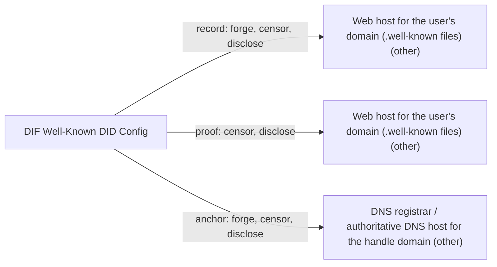

# DIF Well-Known DID Config

## C1. Proof mechanism

Bidirectional public proof: the DID signs a self-issued DomainLinkageCredential naming the origin, the domain hosts it at /.well-known/did-configuration.json, and the DID document lists the origin in a LinkedDomains service (https://identity.foundation/well-known-did-configuration/resources/did-configuration/).

## C2. Verifier independence

The verifier fetches the well-known file, resolves the DID, checks the signature against assertionMethod keys and checks that origin matches. No third-party issuer, but it is online-only and relies on DNS and WebPKI.

## C3. Platform coverage and fragility

Only web origins; no social or email anchors. Fragility is that of the user's own web hosting; Microsoft Authenticator also rejects HTTP redirects (https://learn.microsoft.com/en-us/entra/verified-id/how-to-dnsbind).

## C4. Key lifecycle

No revocation beyond expiry or removal; credentials must be re-signed after key rotation since they validate against the current DID document. Key recovery is left to the DID method.

## C5. Freshness and replay

expirationDate is mandatory, so stale credentials lapse; no nonce or log. A domain that changes owner stops serving the file, so the link disappears.

## C6. Threat model

Whoever controls the domain's web content or DNS can delete the link but cannot forge a signature from the DID. For did:web DIDs on the same domain, the domain controller controls both sides, which collapses the two-party check.

## C7. Key system portability

DID-method-agnostic, so any DID (including did:key wrapping an ed25519 key) can sign a DLC; the reverse LinkedDomains discovery needs a method with service endpoints.

## C8. Adoption and status

v1.0.0 is a DIF Ratified Deliverable; the editor's draft was last changed 2025-10. Deployed in Microsoft Entra Verified ID, whose Authenticator displays a verified domain (https://learn.microsoft.com/en-us/entra/verified-id/how-to-dnsbind).

## C9. Effort tier

Attach tier: any existing DID holder with a domain can generate and host the file.

## C10. Sovereignty

Record and proof live on the user's own web host and DNS; no DIF-run service. The web host and registrar can censor; neither can forge without the DID key unless the DID itself is did:web on that domain.

## Misfit notes

Fits 'bidirectional public proof' cleanly, but only for domains. One subtlety: when the DID is did:web on the same domain (Microsoft's default), the 'link' is circular: the domain vouches for itself, so it adds no independent evidence. The DID-to-origin direction is optional and impossible for did:key, so for some DIDs it is effectively one-directional.

## Surprises

Expiry is mandatory, which few people expect for a domain-link file. Microsoft Entra Verified ID uses it with did:web, which makes the link largely self-referential, and Microsoft says changing the linked domain is unsupported: you must opt out and re-onboard. Spec examples use did:key, which cannot express the LinkedDomains back-link.

## Facts

| Fact | Value | Source | Date | Note |
|---|---|---|---|---|
| `proof.key_signs_claim` | yes | [link](https://identity.foundation/well-known-did-configuration/resources/did-configuration/) | 2025-10-31 | A Domain Linkage Credential is a self-issued VC (issuer = subject = DID) with credentialSubject.origin, signed by a DID key (JSON-LD proof or JWT). |
| `proof.anchor_publishes_key` | yes | [link](https://identity.foundation/well-known-did-configuration/resources/did-configuration/) | 2025-10-31 | The origin serves /.well-known/did-configuration.json listing the linked DIDs' credentials. |
| `proof.third_party_signs_binding` | no | [link](https://identity.foundation/well-known-did-configuration/resources/did-configuration/) | 2025-10-31 | Self-issued; only the DID controller signs. |
| `proof.uses_oauth_oidc` | no | [link](https://identity.foundation/well-known-did-configuration/resources/did-configuration/) | 2025-10-31 | Control of the origin is shown by hosting the file over HTTPS. |
| `proof.capability_delegation` | no | [link](https://identity.foundation/well-known-did-configuration/resources/did-configuration/) | 2025-10-31 | Verifier SHOULD consider the origin controller and DID controller the same entity: a sameness claim. |
| `proof.anchor_is_dns` | yes | [link](https://identity.foundation/well-known-did-configuration/resources/did-configuration/) | 2025-10-31 | Anchor is a web origin (HTTPS domain). |
| `proof.anchor_is_email` | no | [link](https://identity.foundation/well-known-did-configuration/resources/did-configuration/) | 2025-10-31 | Only domain origins. |
| `proof.anchor_is_social` | no | [link](https://identity.foundation/well-known-did-configuration/resources/did-configuration/) | 2025-10-31 | Only domain origins; a hosted subdomain on a platform could serve the file, but the spec requires the origin root. |
| `verify.offline_possible` | no | [link](https://identity.foundation/well-known-did-configuration/resources/did-configuration/) | 2025-10-31 | Verifier must fetch the well-known resource from the origin and resolve the DID. |
| `verify.fetches_anchor` | yes | [link](https://identity.foundation/well-known-did-configuration/resources/did-configuration/) | 2025-10-31 | Fetch https://<origin>/.well-known/did-configuration.json. |
| `verify.needs_issuer_trust` | no | [link](https://identity.foundation/well-known-did-configuration/resources/did-configuration/) | 2025-10-31 | Signature is checked against the DID's own assertionMethod keys; the only implicit trust is WebPKI/TLS. |
| `verify.needs_registry` | no | [link](https://identity.foundation/well-known-did-configuration/resources/did-configuration/) | 2025-10-31 | Not by the spec; DID resolution may hit a registry depending on DID method (none for did:key/did:web). |
| `verify.no_author_service` | yes | [link](https://identity.foundation/well-known-did-configuration/resources/did-configuration/) | 2025-10-31 | No DIF-run service is involved. |
| `verify.breaks_if_api_closed` | no | [link](https://identity.foundation/well-known-did-configuration/resources/did-configuration/) | 2025-10-31 | Anchor is a domain the user controls; no platform API. |
| `lifecycle.survives_key_rotation` | no | [link](https://identity.foundation/well-known-did-configuration/resources/did-configuration/) | 2025-10-31 | Credentials are validated against current assertionMethod keys in the resolved DID document; after rotation they must be re-signed. |
| `lifecycle.explicit_revocation` | no | [link](https://identity.foundation/well-known-did-configuration/resources/did-configuration/) | 2025-10-31 | Spec defines no revocation; removal from the file or expiry are the only mechanisms. |
| `lifecycle.expiry` | yes | [link](https://identity.foundation/well-known-did-configuration/resources/did-configuration/) | 2025-10-31 | issuanceDate and expirationDate MUST be present. |
| `lifecycle.key_recovery` | no | [link](https://identity.foundation/well-known-did-configuration/resources/did-configuration/) | 2025-10-31 | Delegated entirely to the DID method; not defined by this spec. |
| `lifecycle.replay_protected` | yes | [link](https://identity.foundation/well-known-did-configuration/resources/did-configuration/) | 2025-10-31 | Mandatory expirationDate and origin matching bound replay; there is no nonce or log. |
| `record.transparency_log` | no | [link](https://identity.foundation/well-known-did-configuration/resources/did-configuration/) | 2025-10-31 | No log. |
| `record.self_hosted_possible` | yes | [link](https://identity.foundation/well-known-did-configuration/resources/did-configuration/) | 2025-10-31 | The file is hosted on the user's own origin; the DID record's hosting depends on the method. |
| `record.multi_operator` | no | [link](https://identity.foundation/well-known-did-configuration/resources/did-configuration/) | 2025-10-31 | Single web host per origin. |
| `portability.generic_key` | yes | [link](https://identity.foundation/well-known-did-configuration/resources/did-configuration/) | 2025-10-31 | Any DID method; spec examples use did:key. The DID-to-origin direction (LinkedDomains service) needs a method whose DID document supports services, so did:key cannot do it. |
| `portability.extensible_anchors` | no | [link](https://identity.foundation/well-known-did-configuration/resources/did-configuration/) | 2025-10-31 | Web origins only. |
| `adoption.spec_maturity` | 2 | [link](https://identity.foundation/well-known-did-configuration/resources/did-configuration/) | 2025-10-31 | v1.0.0 is a 'DIF Ratified Deliverable' of the Identifiers & Discovery WG; editor's draft continues. |
| `adoption.active_2026` | yes | [link](https://github.com/decentralized-identity/well-known-did-configuration) | 2025-10-31 | Last spec changes 2025-10-31 (VC 1.1 link fixes, reference implementations); no 2026 commits found. |
| `adoption.client_display` | yes | [link](https://learn.microsoft.com/en-us/entra/verified-id/how-to-dnsbind) | 2026-03-25 | Microsoft Authenticator shows a Verified domain page, or a full-page unverified-domain warning, based on the DID's LinkedDomains and did-configuration.json. |
| `effort.attachable` | yes | [link](https://identity.foundation/well-known-did-configuration/resources/did-configuration/) | 2025-10-31 | Any existing DID can sign a DLC and the user hosts it on their domain. |
| `effort.requires_platform_migration` | no | [link](https://identity.foundation/well-known-did-configuration/resources/did-configuration/) | 2025-10-31 | No new identity system. |

## Sovereignty

## Operators

| Layer | Operator | Forge | Censor | Disclose | Note |
|---|---|---|---|---|---|
| record | Web host for the user's domain (.well-known files) (other) | yes | yes | yes | Applies when the DID is did:web (Microsoft's default): the host controls the DID document and can sign a fresh DLC itself. For other DID methods the record operator is that method's registry. |
| proof | Web host for the user's domain (.well-known files) (other) | no | yes | yes | Hosts did-configuration.json and can delete it, but cannot sign a DLC without the DID key (unless the DID is did:web on the same host). Sees verifier fetches. |
| anchor | DNS registrar / authoritative DNS host for the handle domain (other) | yes | yes | yes | Override forge no → yes. Can redirect or seize the domain, which breaks the link, but cannot forge the DID signature unless the DID is did:web on that domain. |
