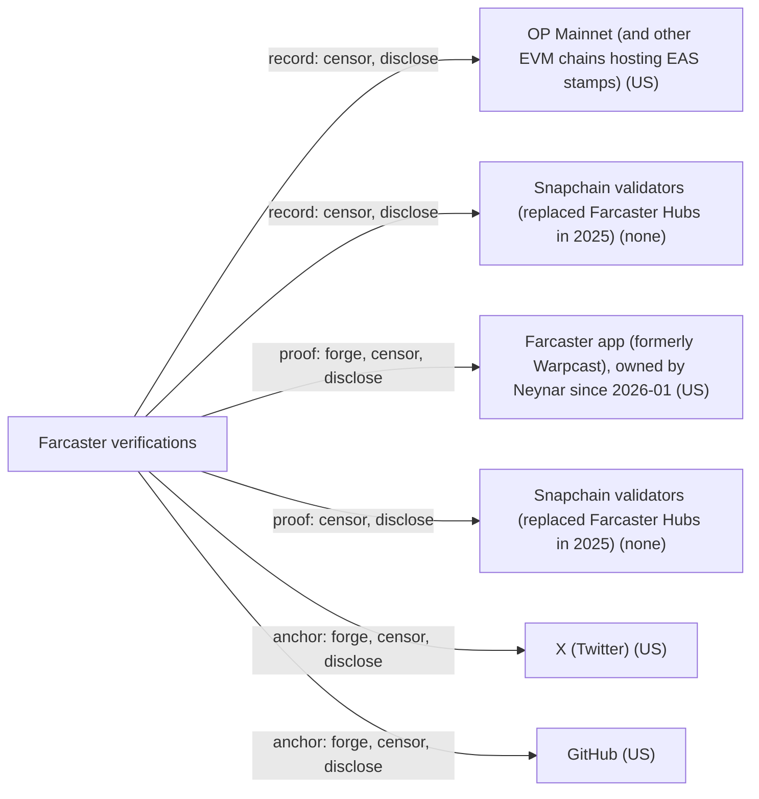

# Farcaster verifications

## C1. Proof mechanism

There are two different mechanisms. For X (and, in the protocol, GitHub), the Farcaster app runs OAuth with X and then publishes a UserDataAdd message of type TWITTER/GITHUB, signed with an app key it holds for the user's fid. This is the FIP-19 'social attestation' (https://github.com/farcasterxyz/protocol/discussions/199). For Ethereum and Solana addresses, the address signs an EIP-712 claim naming the fid, and the fid's signer publishes it as a VerificationAddAddress message (https://github.com/farcasterxyz/snapchain/blob/main/proto/definitions/message.proto). So the address binding is bidirectional and the social binding is an issuer attestation after OAuth.

## C2. Verifier independence

Verifiers never contact X. They read the attestation from Snapchain and check the signer against KeyRegistry on OP Mainnet. FIP-19 states plainly that attestations are not verified: the attesting fid only claims it checked, so a verifier must trust the attestor (in practice the official app). Verifying needs a Snapchain node and an OP Mainnet RPC. Both can be self-run, but neither works offline.

## C3. Platform coverage and fragility

Only X and GitHub are defined as social anchors, as hard-coded UserDataType enum values. Adding a platform means a FIP and a protocol change. Ethereum and Solana addresses are the other anchors, and ENS/fname are username proofs, not anchors to external accounts. Existing attestations survive an X API closure, but new ones need X OAuth.

## C4. Key lifecycle

The identity is the fid in IdRegistry. Its custody address can be transferred, and a designated recovery address can move it at any time (https://docs.farcaster.xyz/learn/architecture/contracts), so links survive custody rotation. Removing the app signer that signed a message revokes all of that signer's messages, including the X attestation. Address verifications have an explicit VerificationRemove message.

## C5. Freshness and replay

Address claims include a recent Ethereum blockhash and the fid, which makes them hard to replay out of context. The X attestation has no expiry and no re-check, so if an X handle changes hands the stale attestation remains. Snapchain gives messages a consensus order and timestamps.

## C6. Threat model

The main forger is the attesting app: it holds an app key for each user who signs in and asserts the X handle with no cryptographic proof from X. X itself can also forge by letting a different person pass OAuth for the handle. Chain and Snapchain operators can censor or delay but cannot forge signed messages.

## C7. Key system portability

Only Farcaster fids can be linked. The custody key is an Ethereum address, and app signers are ed25519 keys authorized by it. No DID or arbitrary key can be anchored. Sign In With Farcaster lets other apps use the fid, but that runs the other direction.

## C8. Adoption and status

Snapchain replaced the Hub network as Farcaster's data layer in 2025 (mainnet reported March to April 2025, https://www.theblock.co/post/347606/decentralized-social-media-protocol-farcaster-launches-blockchain-like-data-layer-snapchain). Warpcast was renamed the Farcaster app in May 2025 (https://www.panewslab.com/en/articles/di90phu5). On 2026-01-21 Neynar acquired Farcaster from Merkle Manufactory: protocol contracts, repos, app and Clanker (https://www.coindesk.com/business/2026/01/21/farcaster-founders-step-back-as-neynar-acquires-struggling-crypto-social-app). Snapchain v0.14.2 shipped 2026-08-13 under Neynar ticketing (NEYN-...).

## C9. Effort tier

Migrate tier: you must register a fid on OP Mainnet and use a Farcaster client that issues the X attestation. There is no way to attach the link to a key system you already own, except that an Ethereum address you own can serve as custody.

## C10. Sovereignty

The identity record is on OP Mainnet (sequencer run by OP Labs) and messages are on Snapchain validators. Since January 2026 a single company, Neynar, owns the protocol repos, the official app (the only trusted attestor) and much of the infrastructure. X controls the anchor and the OAuth step.

## Misfit notes

Farcaster mixes two families in one product. X/GitHub links are issuer attestations after OAuth, but the 'issuer' is a client app acting with an app key delegated by the user's own fid. The signature is technically in the user's key namespace and is not a separate issuer credential, so a verifier cannot tell a self-claim from an attestation except by trusting which app key signed it. Ethereum and Solana address verifications are bidirectional proofs, but the anchors are wallets, not accounts people already trust. The capability-delegation family appears only inside the system (custody to app signer via KeyRegistry), never in the anchor link. Effort tier is clearly migrate.

## Surprises

FIP-19 says plainly that attestations are not verified, so the X badge rests entirely on trusting the official app. The X attestation is signed by an app key held by the app, which the user authorized from their own fid, so 'third-party issuer' and 'user's own signer' blur. Revoking that app signer silently deletes the attestation along with every message it signed. GitHub has a protocol enum value but I found no evidence it is deployed. Since January 2026 the protocol, the official client and the de facto sole attestor are all owned by one company, Neynar, which was previously an infrastructure vendor. The recovery address can take the account at any time without the owner's consent.

## Facts

| Fact | Value | Source | Date | Note |
|---|---|---|---|---|
| `proof.key_signs_claim` | yes | [link](https://github.com/farcasterxyz/protocol/discussions/199) | 2024-10-16 | The X/GitHub link is a UserDataAdd (TWITTER=8, GITHUB=9) message signed by an ed25519 app key registered to the user's fid. That key is held by the Farcaster app, not by the user. For ETH/SOL verifications, the fid's signer signs a VerificationAddAddress naming the address. |
| `proof.anchor_publishes_key` | no | [link](https://github.com/farcasterxyz/protocol/discussions/199) | 2024-10-16 | X and GitHub publish nothing naming the fid. The only bidirectional case is ETH/Solana address verification, where the address signs an EIP-712 claim naming the fid. Those addresses are not social or DNS anchors. |
| `proof.third_party_signs_binding` | yes | [link](https://github.com/farcasterxyz/protocol/discussions/199) | 2024-10-16 | FIP-19: the attesting app (Warpcast, now the Farcaster app run by Neynar) signs the X/GitHub binding after OAuth. Verifiers must choose which attesting fids to trust. |
| `proof.uses_oauth_oidc` | yes | [link](https://github.com/farcasterxyz/protocol/discussions/199) | 2024-10-16 | Every user completes an OAuth login to X inside Warpcast before the app publishes the username. |
| `proof.capability_delegation` | no | [link](https://github.com/farcasterxyz/protocol/discussions/199) | 2024-10-16 | The anchor link is a sameness attestation. Capability delegation exists only inside Farcaster: custody address authorizes app signer keys in KeyRegistry. |
| `proof.anchor_is_dns` | no | [link](https://github.com/farcasterxyz/snapchain/blob/main/proto/definitions/message.proto) | 2026-08 | There is no DNS-domain verification type. Username proofs cover only fnames and ENS (.eth) names, and the URL user-data field is unverified. |
| `proof.anchor_is_email` | no | [link](https://github.com/farcasterxyz/snapchain/blob/main/proto/definitions/message.proto) | 2026-08 | No email user-data or verification type exists in the protocol messages. |
| `proof.anchor_is_social` | yes | [link](https://github.com/farcasterxyz/snapchain/blob/main/proto/definitions/message.proto) | 2026-08 | USER_DATA_TYPE_TWITTER=8 and USER_DATA_TYPE_GITHUB=9 are in the current Snapchain proto. In 2024 Warpcast said GitHub had no timeline, and I found no source confirming GitHub is deployed in the app. |
| `verify.offline_possible` | no | [link](https://docs.farcaster.xyz/learn/architecture/contracts) | 2026-10 | A verifier must confirm the signer key is ADDED for the fid in KeyRegistry on OP Mainnet, and that the message is current in Snapchain. Docs page is undated (date = accessed). |
| `verify.fetches_anchor` | no | [link](https://github.com/farcasterxyz/protocol/discussions/199) | 2024-10-16 | The verifier reads the attestation from Snapchain and never contacts X or GitHub. Only the attesting app talks to X, through OAuth. |
| `verify.needs_issuer_trust` | yes | [link](https://github.com/farcasterxyz/protocol/discussions/199) | 2024-10-16 | FIP-19: attestations are not verified. The attesting fid only claims it verified the account, and Warpcast planned to show only its own attestations. |
| `verify.needs_registry` | yes | [link](https://docs.farcaster.xyz/learn/architecture/overview) | 2026-10 | IdRegistry and KeyRegistry live on OP Mainnet, and messages live in Snapchain. Docs page is undated (date = accessed). |
| `verify.no_author_service` | no | [link](https://www.coindesk.com/business/2026/01/21/farcaster-founders-step-back-as-neynar-acquires-struggling-crypto-social-app) | 2026-01-21 | Anyone can run a Snapchain node, but the binding only means something if you trust the official app's attestation. Neynar now owns that app and the protocol repos. |
| `verify.breaks_if_api_closed` | no | [link](https://github.com/farcasterxyz/protocol/discussions/199) | 2024-10-16 | Existing attestations remain verifiable without X. New links would stop, because they need X OAuth. |
| `lifecycle.survives_key_rotation` | yes | [link](https://github.com/farcasterxyz/protocol/blob/main/docs/SPECIFICATION.md) | 2023-11-15 | Links bind to the fid, not the custody address, so custody transfer or recovery keeps them. Caveat: removing the app signer that signed the UserData message revokes all of that signer's messages. |
| `lifecycle.explicit_revocation` | yes | [link](https://github.com/farcasterxyz/snapchain/blob/main/proto/definitions/message.proto) | 2026-08 | VerificationRemove messages exist for addresses, UserData can be overwritten, and signer removal in KeyRegistry revokes that signer's messages. FIP-19 said X disconnect was not yet implemented in 2024. |
| `lifecycle.expiry` | no | [link](https://github.com/farcasterxyz/protocol/blob/main/docs/SPECIFICATION.md) | 2023-11-15 | Verifications and UserData do not expire. Only fname/ENS username proofs are revalidated daily. |
| `lifecycle.key_recovery` | yes | [link](https://docs.farcaster.xyz/learn/architecture/contracts) | 2026-10 | A recovery address set in IdRegistry can transfer the fid at any time. Docs page is undated (date = accessed). |
| `lifecycle.replay_protected` | no | [link](https://github.com/farcasterxyz/protocol/discussions/199) | 2024-10-16 | The X attestation is a one-time OAuth result with no expiry or re-check, so if the X handle changes owner the stale attestation stays. ETH verification claims include a blockhash and fid, but that protects only the address claims. |
| `record.transparency_log` | yes | [link](https://docs.farcaster.xyz/learn/architecture/contracts) | 2026-10 | The identity record (fid, custody, recovery, signer keys) is OP Mainnet chain state, which is append-only. Snapchain messages are consensus-ordered but subject to storage-limit pruning. |
| `record.self_hosted_possible` | no | [link](https://docs.farcaster.xyz/learn/architecture/overview) | 2026-10 | The record requires OP Mainnet contracts and the Snapchain validator network. A user can run a read node but cannot be the authority. |
| `record.multi_operator` | yes | [link](https://github.com/farcasterxyz/protocol/discussions/207) | 2025 | Snapchain has multiple validators (a secondary source reports 11, community-voted) plus OP Mainnet nodes. Since 2026 Neynar operates protocol infrastructure, and Snapchain v0.14.2 reads validator config from an on-chain SnapchainConfigRegistry. |
| `portability.generic_key` | no | [link](https://github.com/farcasterxyz/snapchain/blob/main/proto/definitions/message.proto) | 2026-08 | Only fids can be linked. Verifications support only PROTOCOL_ETHEREUM and PROTOCOL_SOLANA addresses, not DIDs or arbitrary ed25519 keys. |
| `portability.extensible_anchors` | no | [link](https://github.com/farcasterxyz/protocol/discussions/199) | 2024-10-16 | FIP-19 adds a new UserDataType enum value per platform, so a new platform needs a FIP and a protocol/proto change. |
| `adoption.spec_maturity` | 1 | [link](https://github.com/farcasterxyz/protocol/discussions/199) | 2024-10-16 | FIPs are proposals in a repo controlled by the protocol owner (Merkle, now Neynar). FIP-19 is marked Finalized there. It has no independent standards body. |
| `adoption.active_2026` | yes | [link](https://github.com/farcasterxyz/snapchain/releases) | 2026-08-13 | Snapchain v0.14.2 was released 2026-08-13. Snapchain replaced Hubs in 2025, and Neynar acquired Farcaster in January 2026. |
| `adoption.client_display` | yes | [link](https://github.com/farcasterxyz/protocol/discussions/199) | 2024-10-16 | Warpcast verified X accounts and planned to show its own attestations on profiles. The app is now named Farcaster. I found no current official screenshot or doc, so the evidence is weaker than ideal. |
| `effort.attachable` | no | [link](https://docs.farcaster.xyz/learn/architecture/contracts) | 2026-10 | The link exists only for a Farcaster fid registered in IdRegistry. An existing Ethereum address can become custody, but a Farcaster account is required. |
| `effort.requires_platform_migration` | yes | [link](https://github.com/farcasterxyz/protocol/discussions/199) | 2024-10-16 | The user needs a fid, and the X attestation must be issued by a Farcaster client app (in practice the official app). |

## Sovereignty

## Operators

| Layer | Operator | Forge | Censor | Disclose | Note |
|---|---|---|---|---|---|
| record | OP Mainnet (and other EVM chains hosting EAS stamps) (US) | no | yes | yes | The sequencer can delay or censor IdRegistry/KeyRegistry txs but cannot forge custody signatures. It sees tx submission metadata. |
| record | Snapchain validators (replaced Farcaster Hubs in 2025) (none) | no | yes | yes | Validators can refuse to include messages but cannot forge ed25519-signed messages. Nodes see client request metadata. |
| proof | Farcaster app (formerly Warpcast), owned by Neynar since 2026-01 (US) | yes | yes | yes | The app holds an app signer for each user's fid and asserts the X handle without cryptographic proof (FIP-19). It holds OAuth tokens and account data. |
| proof | Snapchain validators (replaced Farcaster Hubs in 2025) (none) | no | yes | yes | Stores and orders the UserData/Verification messages. |
| anchor | X (Twitter) (US) | yes | yes | yes | X can let another person pass OAuth for a handle or reassign it. It can also refuse OAuth, which blocks new links. |
| anchor | GitHub (US) | yes | yes | yes | Same as X, if the GitHub attestation is deployed (unconfirmed). |
