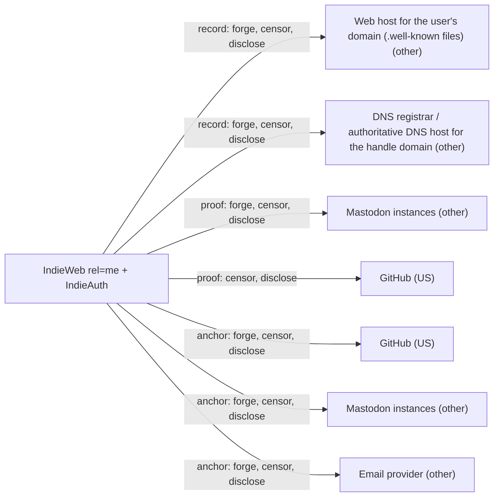

# IndieWeb rel=me + IndieAuth

## C1. Proof mechanism

No cryptographic key is involved. rel=me is a bidirectional public link between two URLs (https://microformats.org/wiki/rel-me). IndieAuth is an OAuth 2.0-based login protocol where the user's domain names its authorization server (https://indieauth.spec.indieweb.org/).

## C2. Verifier independence

Anyone can verify by fetching both pages. In practice Mastodon instances verify and cache the result (https://github.com/mastodon/mastodon/blob/main/app/services/verify_link_service.rb), and each remote instance re-verifies independently (https://github.com/mastodon/mastodon/blob/main/app/services/activitypub/process_account_service.rb).

## C3. Platform coverage and fragility

Any site emitting rel=me works: Mastodon, GitHub, GitLab, Codeberg, and email via IndieLogin (https://indielogin.com/setup). Platforms that render client-side or block scraping break it.

## C4. Key lifecycle

No key lifecycle: identity is the domain, so key rotation is moot. Domain loss means identity loss, with no revocation besides removing the link.

## C5. Freshness and replay

No freshness. Mastodon sets verified_at once and only re-checks unverified fields (https://github.com/mastodon/mastodon/blob/main/app/models/account/field.rb), so a checkmark can outlive the backlink. An expired domain bought by someone else inherits the identity.

## C6. Threat model

Whoever controls the domain's hosting or DNS controls the identity. A Mastodon instance controls the checkmark shown to its own users. No defense against a compromised web host.

## C7. Key system portability

Not a key system. It can point at a did:web or keyoxide URL, but checks nothing about key control.

## C8. Adoption and status

rel=me is a microformats/XFN community spec. IndieAuth was a W3C WG Note (2018, https://www.w3.org/TR/indieauth/) and is now a living standard (2024-07-11) with commits in 2026-09. Widely displayed via Mastodon's verified links.

## C9. Effort tier

Trivial for anyone with a website. There is no key to attach, so for OOBTA it neither attaches to a key system nor requires migration.

## C10. Sovereignty

Record lives on the user's web host and DNS registrar, which can both censor and forge. Anchors (GitHub, Mastodon) can delete backlinks and log fetches.

## Misfit notes

Misfit for OOBTA: no key is involved at all. rel=me is a bidirectional public proof between two URLs, but neither end is a self-certifying key, so 'key' facts are vacuous (key_rotation marked yes and key_recovery no as N/A). IndieAuth is OAuth 2.0 where the user's domain names its own authorization server, a delegation that fits neither the issuer-attestation family (the user can be the issuer) nor capability delegation of a key. It can serve as the anchor side for other systems (did:web, Keyoxide, Mastodon) rather than as an OOBTA protocol.

## Surprises

Mastodon never re-checks a verified link: verified_at is set once and only unverified fields are re-tested, so a checkmark survives removal of the backlink until the field is edited. Each remote server runs its own check. IndieLogin.com, the main IndieAuth bridge, actually authenticates via OAuth to GitHub/GitLab/Codeberg or an emailed code after finding rel=me. The W3C IndieAuth document is only a 2018 WG Note; the living spec moved on (PKCE mandatory, metadata discovery).

## Facts

| Fact | Value | Source | Date | Note |
|---|---|---|---|---|
| `proof.key_signs_claim` | no | [link](https://microformats.org/wiki/rel-me) | 2023-08-11 | No key at all: rel=me is an HTML link between two URLs; nothing is signed. |
| `proof.anchor_publishes_key` | yes | [link](https://microformats.org/wiki/rel-me) | 2023-08-11 | Anchor profile (GitHub, Mastodon) must link back to the identifier, which is a URL, not a key. |
| `proof.third_party_signs_binding` | no | [link](https://microformats.org/wiki/rel-me) | 2023-08-11 | No signatures by anyone. |
| `proof.uses_oauth_oidc` | no | [link](https://microformats.org/wiki/rel-me) | 2023-08-11 | Creating rel=me links needs no OAuth. IndieAuth is an identity layer on OAuth 2.0, and IndieLogin.com uses OAuth to GitHub/GitLab/Codeberg after finding the rel=me link, but those are for logging in, not for creating the link. |
| `proof.capability_delegation` | no | [link](https://indieauth.spec.indieweb.org/) | 2024-07-11 | rel=me claims sameness. IndieAuth does delegate login to an authorization server named on the user's domain, but that is not the identity link. |
| `proof.anchor_is_dns` | yes | [link](https://microformats.org/wiki/rel-me) | 2023-08-11 | The user's own domain/home page is the identity; rel=me ties it to other profiles. |
| `proof.anchor_is_email` | yes | [link](https://indielogin.com/setup) | 2026-09 | IndieLogin.com accepts a rel=me mailto: link and sends a code. One-directional (email cannot link back). |
| `proof.anchor_is_social` | yes | [link](https://docs.joinmastodon.org/user/profile/) | 2026 | Mastodon verifies rel=me links; GitHub, GitLab, Codeberg used by IndieLogin. |
| `verify.offline_possible` | no | [link](https://github.com/mastodon/mastodon/blob/main/app/services/verify_link_service.rb) | 2026-09-30 | Verifier must fetch the linked page and look for rel=me. |
| `verify.fetches_anchor` | yes | [link](https://github.com/mastodon/mastodon/blob/main/app/services/verify_link_service.rb) | 2026-09-30 | Mastodon's VerifyLinkService fetches the URL and parses rel=me links. |
| `verify.needs_issuer_trust` | no | [link](https://microformats.org/wiki/rel-me) | 2023-08-11 | No issuer. Viewers of a Mastodon checkmark trust the instance that ran the check. |
| `verify.needs_registry` | no | [link](https://microformats.org/wiki/rel-me) | 2023-08-11 | Plain HTTP fetches; no registry. |
| `verify.no_author_service` | yes | [link](https://microformats.org/wiki/rel-me) | 2023-08-11 | Any client can fetch both pages; there is no central service. |
| `verify.breaks_if_api_closed` | yes | [link](https://github.com/mastodon/mastodon/blob/main/app/services/verify_link_service.rb) | 2026-09-30 | Needs plain-HTML fetch of the profile without JavaScript; platforms that block scraping or render client-side break it. |
| `lifecycle.survives_key_rotation` | na | [link](https://microformats.org/wiki/rel-me) | 2023-08-11 | Override (was yes): IndieWeb rel=me and IndieAuth use no key. The agent recorded yes and asked for N/A. |
| `lifecycle.explicit_revocation` | no | [link](https://microformats.org/wiki/rel-me) | 2023-08-11 | Only by removing the link. |
| `lifecycle.expiry` | no | [link](https://github.com/mastodon/mastodon/blob/main/app/models/account/field.rb) | 2026-09-30 | No expiry; Mastodon stores verified_at and only re-verifies fields that are not yet verified. |
| `lifecycle.key_recovery` | na | [link](https://microformats.org/wiki/rel-me) | 2023-08-11 | Override (was no): IndieWeb rel=me and IndieAuth use no key. The agent recorded no and asked for N/A. |
| `lifecycle.replay_protected` | no | [link](https://github.com/mastodon/mastodon/blob/main/app/models/account/field.rb) | 2026-09-30 | No timestamps or nonces. Mastodon keeps a verified checkmark until the field changes, even if the backlink is later removed. |
| `record.transparency_log` | no | [link](https://microformats.org/wiki/rel-me) | 2023-08-11 | No log. |
| `record.self_hosted_possible` | yes | [link](https://microformats.org/wiki/rel-me) | 2023-08-11 | Identity record is the user's own home page. |
| `record.multi_operator` | no | [link](https://microformats.org/wiki/rel-me) | 2023-08-11 | Single web host per domain. |
| `portability.generic_key` | no | [link](https://microformats.org/wiki/rel-me) | 2023-08-11 | Binds URLs, not keys. Can point at a did:web or key profile URL but checks no key control. |
| `portability.extensible_anchors` | yes | [link](https://microformats.org/wiki/rel-me) | 2023-08-11 | Any page that can emit rel=me works without spec change. |
| `adoption.spec_maturity` | 2 | [link](https://www.w3.org/TR/indieauth/) | 2018-01-23 | IndieAuth: W3C Social Web WG Note (2018), now an IndieWeb Living Standard (2024-07-11). rel=me: microformats/XFN 1.1 community spec. Neither is a W3C Rec or RFC. |
| `adoption.active_2026` | yes | [link](https://github.com/indieweb/indieauth) | 2026-09-20 | IndieAuth spec repo commits 2026-09-20; Mastodon v4.7.2 (2026-09-15) still verifies rel=me. |
| `adoption.client_display` | yes | [link](https://docs.joinmastodon.org/user/profile/) | 2026 | Mastodon shows a green verified checkmark on profile links. |
| `effort.attachable` | no | [link](https://microformats.org/wiki/rel-me) | 2023-08-11 | No key binding: adding rel=me to a key system just links URLs. Only a URL-shaped identifier (did:web domain) gains anything. |
| `effort.requires_platform_migration` | no | [link](https://microformats.org/wiki/rel-me) | 2023-08-11 | Works with an existing website and accounts. |

## Sovereignty

## Operators

| Layer | Operator | Forge | Censor | Disclose | Note |
|---|---|---|---|---|---|
| record | Web host for the user's domain (.well-known files) (other) | yes | yes | yes | Controls the home page that is the identity; it can add rel=me to any profile that links back, e.g. one the attacker controls. |
| record | DNS registrar / authoritative DNS host for the handle domain (other) | yes | yes | yes | Controls the domain and can repoint it to attacker content. |
| proof | Mastodon instances (other) | yes | yes | yes | Home instance sets verified_at in its own database and can show a checkmark to its users without a real backlink. Remote instances re-verify independently. |
| proof | GitHub (US) | no | yes | yes | Can add or remove the rel=me link on a profile, but the domain must link back. |
| anchor | GitHub (US) | yes | yes | yes | Override forge no → yes. |
| anchor | Mastodon instances (other) | yes | yes | yes | Override forge no → yes. |
| anchor | Email provider (other) | yes | yes | yes | Override forge no → yes. IndieLogin email code: the provider can read and intercept codes (that is login, not forging the public link). |
