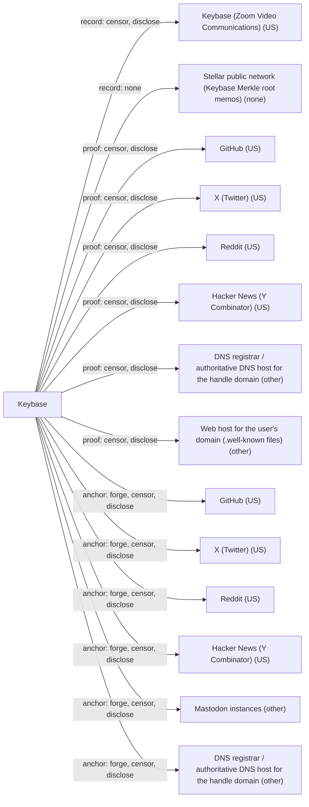

# Keybase

## C1. Proof mechanism

Bidirectional public proof: the user signs a sigchain link naming the remote account with a Keybase device key, then posts the signed text on the anchor (https://book.keybase.io/docs/server). The Keybase server signs Merkle roots over all sigchains but does not attest bindings.

## C2. Verifier independence

Clients scrape anchors themselves but must get sigchains and Merkle paths from keybase.io. The Stellar-anchored root (https://book.keybase.io/docs/server/stellar) detects server forks but not unavailability. There is no offline or third-party path.

## C3. Platform coverage and fragility

Supports Twitter/X, GitHub, Reddit, HN, DNS, websites, plus partner sites via proof integration (https://keybase.io/blog/keybase-proofs-for-mastodon-and-everyone). New or redone Twitter/X and Reddit proofs fail after API changes (https://github.com/keybase/client/issues/27225, open since 2024-07). The lookup API still reports old proofs as OK.

## C4. Key lifecycle

Per-device keys with paper-key recovery; revoking a device leaves earlier signed proofs valid (https://book.keybase.io/docs/server). Proofs can be revoked by sigchain revoke links. Account reset discards the sigchain and all proofs.

## C5. Freshness and replay

Every link has ctime/seqno and is committed to a Merkle tree anchored hourly in Stellar (latest 2026-10-01). Signatures carry expire_in, but the client ignores sigchain expiry (https://github.com/keybase/client/blob/master/go/libkb/expire_times.go).

## C6. Threat model

Designed against a malicious Keybase server: it cannot forge, roll back, or fork sigchains undetected. It can still censor, withhold, or reset accounts. Anchor platforms can delete proofs but cannot forge them.

## C7. Key system portability

Anchors only the Keybase account identity (NaCl device keys, optional PGP). Generic DIDs or external ed25519 keys cannot be the subject.

## C8. Adoption and status

Vendor-only. Zoom acquired Keybase in 2020 (https://www.zoom.com/en/blog/zoom-acquires-keybase-and-announces-goal-of-developing-the-most-broadly-used-enterprise-end-to-end-encryption-offering/). Releases continued into 2026 (v6.6.3 2026-06-03, https://github.com/keybase/client/releases) and Stellar root publishing is live, but it is maintenance-only and keybase.pub was shut down in 2023.

## C9. Effort tier

Migrate tier: you must create a Keybase account and sigchain. Existing PGP keys can be imported but the proof belongs to the Keybase account.

## C10. Sovereignty

Keybase (US, Zoom) is the sole record operator and can censor and holds account and metadata. Anchors (GitHub, X, Reddit, HN, DNS) can delete proofs. Only the hourly Stellar root hash is out of Keybase's control.

## Misfit notes

Fits the bidirectional public proof family, with an extra layer the map lacks: a vendor-run append-only log (Merkle tree anchored in Stellar) that orders proofs and revocations. The Keybase server is neither the anchor nor an issuer; it is a mandatory registry/log. Effort tier is migrate, though importing an existing PGP key looks like attach. Proof integration (partner sites hosting the proof and exposing a check API) blurs toward a platform-cooperative model that is neither pure public proof nor OAuth attestation.

## Surprises

Keybase is not dead: releases v6.5.2-v6.6.3 shipped Feb-Jun 2026, commits landed 2026-09-30, and Merkle roots still post to Stellar hourly (last seen 2026-10-01). Yet new Twitter/X and Reddit proofs have been broken since 2024 while the lookup API still shows old ones as state OK. The client hard-codes HonorSigchainExpireTime() to 0, so signature expire_in is ignored. Scraping rules (PVL) are pushed from the server and committed in the Merkle root.

## Facts

| Fact | Value | Source | Date | Note |
|---|---|---|---|---|
| `proof.key_signs_claim` | yes | [link](https://book.keybase.io/docs/server) | 2026-05 | Each identity proof is a sigchain link signed by one of the user's device/PGP keys naming the remote account or domain. |
| `proof.anchor_publishes_key` | yes | [link](https://book.keybase.io/docs/server) | 2026-05 | User posts the signed proof text (Keybase username + sig id) on the anchor (tweet, gist, Reddit post, HN profile, DNS TXT, file on website); client scrapes it. |
| `proof.third_party_signs_binding` | no | [link](https://book.keybase.io/docs/server/stellar) | 2020-01 | Keybase server signs the global Merkle root (and posts its hash to Stellar), which commits to sigchains; this is a log commitment, not an attestation of the binding itself. |
| `proof.uses_oauth_oidc` | no | [link](https://book.keybase.io/docs/server) | 2026-05 | User posts proof text to the anchor; no OAuth to the anchor. Generic 'proof integration' partners (e.g. Mastodon instances) use the partner site's own logged-in session, not OAuth. |
| `proof.capability_delegation` | no | [link](https://book.keybase.io/docs/server) | 2026-05 | Proofs are claims of sameness between Keybase account and remote account; no authority is delegated. |
| `proof.anchor_is_dns` | yes | [link](https://book.keybase.io/account) | 2026-05 | Personal website and DNS TXT proofs are supported (also seen as 'dns' and 'generic_web_site' proof types in the live user lookup API). |
| `proof.anchor_is_email` | no | [link](https://book.keybase.io/account) | 2026-05 | Public proofs listed are website, Twitter, GitHub, Reddit, Hacker News (+ generic partners); email is used privately for account/search, not as a public proof. |
| `proof.anchor_is_social` | yes | [link](https://book.keybase.io/account) | 2026-05 | Twitter/X, GitHub, Reddit, Hacker News, plus Mastodon instances and other partners via proof integration. |
| `verify.offline_possible` | no | [link](https://book.keybase.io/docs/server) | 2026-05 | Client must fetch the sigchain/Merkle path from Keybase and scrape the proof from the anchor. |
| `verify.fetches_anchor` | yes | [link](https://book.keybase.io/docs/server) | 2026-05 | Docs: the keybase client scrapes the social site itself rather than trusting the server. |
| `verify.needs_issuer_trust` | no | [link](https://book.keybase.io/docs/server) | 2026-05 | Binding is signed by the user's key; the Keybase server key only signs Merkle roots, and server misbehaviour is meant to be detectable rather than trusted. |
| `verify.needs_registry` | yes | [link](https://book.keybase.io/docs/server/stellar) | 2020-01 | Verifier fetches the user's sigchain and Merkle path from the Keybase server, optionally cross-checking the root on Stellar. |
| `verify.no_author_service` | no | [link](https://book.keybase.io/docs/server) | 2026-05 | Sigchains are only served by keybase.io (Zoom); no alternate server or mirror exists. |
| `verify.breaks_if_api_closed` | yes | [link](https://github.com/keybase/client/issues/27225) | 2024-07-09 | Open issue (2024-07, unresolved) reports new/redone Twitter/X and Reddit proofs can no longer be detected after platform API changes. |
| `lifecycle.survives_key_rotation` | yes | [link](https://book.keybase.io/docs/server) | 2026-05 | Docs: after a device key is revoked, 'any previous links they've signed are still valid'; proofs belong to the sigchain, not one key. Account reset, however, starts a new sigchain and drops proofs. |
| `lifecycle.explicit_revocation` | yes | [link](https://book.keybase.io/docs/server) | 2026-05 | Sigchain supports revoke links (for keys and earlier sigs, including proofs), logged in the Merkle tree. |
| `lifecycle.expiry` | no | [link](https://github.com/keybase/client/blob/master/go/libkb/expire_times.go) | 2026-09-30 | Sig payloads carry expire_in, but the client's HonorSigchainExpireTime() returns 0 (expiry not honored), and it is only applied to keys, not proofs. |
| `lifecycle.key_recovery` | yes | [link](https://book.keybase.io/account) | 2026-05 | Paper keys and other provisioned devices let a user recover after losing a device; losing all of them forces account reset. |
| `lifecycle.replay_protected` | unknown |  |  | Sigchain links have ctime and seqno and the Merkle log records them, but no source found on whether a re-posted old proof on a re-assigned handle is rejected. |
| `record.transparency_log` | yes | [link](https://book.keybase.io/docs/server/stellar) | 2020-01 | All sigchains sit in a global Merkle tree; roots posted hourly to Stellar (live: latest memo 2026-10-01 via Horizon API). |
| `record.self_hosted_possible` | no | [link](https://book.keybase.io/docs/server) | 2026-05 | Sigchains live only on Keybase servers; no federation or self-hosting. Website/DNS proof can be self-hosted, the record cannot. |
| `record.multi_operator` | no | [link](https://book.keybase.io/docs/server) | 2026-05 | Single operator (Keybase/Zoom); Stellar holds only root hashes, not records. |
| `portability.generic_key` | no | [link](https://book.keybase.io/docs/server) | 2026-05 | Binds a Keybase account (per-device NaCl keys, optional PGP key). Cannot anchor an arbitrary DID or external ed25519 key as the identity. |
| `portability.extensible_anchors` | yes | [link](https://keybase.io/blog/keybase-proofs-for-mastodon-and-everyone) | 2019-04-15 | Proof integration lets partner sites add a config + JSON endpoints; the scraping rules (PVL) and proof-service config are server-distributed and committed in the Merkle root (pvl_hash, proof_services_hash), so no client release needed. Keybase must approve each partner. |
| `adoption.spec_maturity` | 0 | [link](https://book.keybase.io/docs/server) | 2026-05 | Vendor-only; documented by Keybase, no independent spec. |
| `adoption.active_2026` | yes | [link](https://github.com/keybase/client/releases) | 2026-06-03 | Releases v6.5.2 (2026-02-04), v6.6.0 (2026-03-06), v6.6.2 (2026-04-08), v6.6.3 (2026-06-03); commits on 2026-09-30. Maintenance-only, no new features. |
| `adoption.client_display` | yes | [link](https://book.keybase.io/docs/server) | 2026-05 | Keybase app/CLI and keybase.io profile show verified proofs. Note: Twitter/Reddit verification broken for new proofs. |
| `effort.attachable` | no | [link](https://book.keybase.io/docs/server) | 2026-05 | An existing PGP key can be added to a Keybase account, but the link is made from the Keybase sigchain; you cannot add Keybase proofs to your own key system without a Keybase account. |
| `effort.requires_platform_migration` | yes | [link](https://book.keybase.io/docs/server) | 2026-05 | Requires creating a Keybase account and sigchain on keybase.io. |

## Sovereignty

## Operators

| Layer | Operator | Forge | Censor | Disclose | Note |
|---|---|---|---|---|---|
| record | Keybase (Zoom Video Communications) (US) | no | yes | yes | Sigchain links are signed by user keys, so the server cannot forge proofs; forks are detectable via the Merkle/Stellar log. It can withhold or delete accounts, reset them, and holds account, IP and device metadata. |
| record | Stellar public network (Keybase Merkle root memos) (none) | no | no | no | Only root hashes are posted; public chain. |
| proof | GitHub (US) | no | yes | yes | Gist holds the signed proof text; GitHub cannot sign as the user but can delete it. |
| proof | X (Twitter) (US) | no | yes | yes | Tweet holds proof; new proofs currently undetectable. |
| proof | Reddit (US) | no | yes | yes | Proof post in subreddit; new proofs currently undetectable. |
| proof | Hacker News (Y Combinator) (US) | no | yes | yes | Proof in HN profile 'about' field. |
| proof | DNS registrar / authoritative DNS host for the handle domain (other) | no | yes | yes | DNS TXT proof. |
| proof | Web host for the user's domain (.well-known files) (other) | no | yes | yes | keybase.txt on the website. |
| anchor | GitHub (US) | yes | yes | yes | Override forge no → yes. Can suspend the account or reassign the handle. |
| anchor | X (Twitter) (US) | yes | yes | yes | Override forge no → yes. |
| anchor | Reddit (US) | yes | yes | yes | Override forge no → yes. |
| anchor | Hacker News (Y Combinator) (US) | yes | yes | yes | Override forge no → yes. |
| anchor | Mastodon instances (other) | yes | yes | yes | Override forge no → yes. Partner instances (proof integration) host the proof and a check API. |
| anchor | DNS registrar / authoritative DNS host for the handle domain (other) | yes | yes | yes | Override forge no → yes. |
