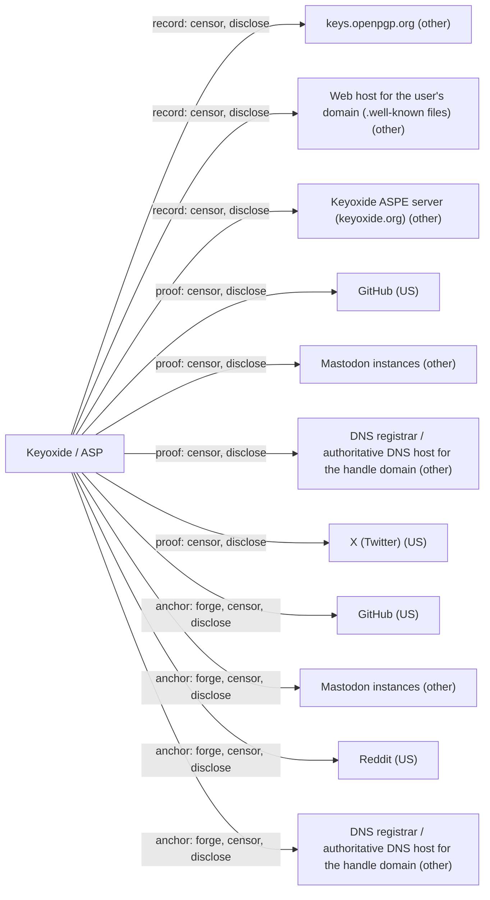

# Keyoxide / ASP

## C1. Proof mechanism

Bidirectional public proof: an OpenPGP key carries signed proof@ariadne.id=<URI> notations (or an ASP JWS lists claims), and the account posts the fingerprint back (https://ariadne.id/core/0/, https://ariadne.id/related/ariadne-signature-profile-0/).

## C2. Verifier independence

Verifier fetches the key (WKD, keys.openpgp.org, or ASPE server) and the proof from each anchor. doip-js and keyoxide-web are self-hostable (https://codeberg.org/keyoxide/doipjs), though keyoxide.org verifies via its own proxy.

## C3. Platform coverage and fragility

Broad coverage, about 30-47 providers including fediverse, Bluesky, GitHub, DNS, Matrix, XMPP (https://docs.keyoxide.org/service-providers/). Each relies on a scraped endpoint (e.g. Twitter oEmbed, https://codeberg.org/keyoxide/doipjs/src/branch/main/src/serviceProviders/twitter.js) and breaks when platforms change.

## C4. Key lifecycle

Proofs embed the primary fingerprint, so rotating the primary key means re-posting all proofs. UID/key revocation is honored by doipjs. No recovery defined.

## C5. Freshness and replay

No timestamps, nonces, or log on the anchor side. ASP has an optional exp claim and OpenPGP keys can expire, but neither is required.

## C6. Threat model

No trusted third party. Keyservers or web hosts can withhold keys but cannot forge notations. The keyoxide.org web verifier and its proxies are trusted to report results honestly unless you verify locally.

## C7. Key system portability

OpenPGP keys of any algorithm, and ASP profiles from raw Ed25519 or P-256 JWKs. No DID support.

## C8. Adoption and status

Ariadne core spec v0 is a 2022 draft; ASP v0 marked active 2023 but still called 'in testing'. Code activity continued in 2025 (keyoxide-web 2025-09-24, https://codeberg.org/keyoxide/keyoxide-web); no 2026 commits found. NLnet-funded.

## C9. Effort tier

Attach tier for anyone with an OpenPGP key: add notations and re-upload. ASP lets non-PGP users create a key-backed profile without migrating to a platform.

## C10. Sovereignty

Record can be fully self-hosted via WKD. keys.openpgp.org (volunteer-run, hosted at Hetzner, Germany) strips UIDs without verified emails and thus their notations. Anchors can delete proofs but cannot forge them.

## Misfit notes

Fits bidirectional public proof cleanly and is the clearest attach-tier example for OpenPGP holders. ASP blurs attach and build: users without a key system get a fresh Ed25519/P-256 key plus an ASPE server profile, which looks like a lightweight platform. Verification often runs through keyoxide.org and its proxies, making the author service a de facto verifier even though it is optional.

## Surprises

The core Ariadne spec v0 still says not to base implementations on it. ASP v0 is marked 'active' but Keyoxide calls it 'in testing'. keys.openpgp.org strips UIDs without a verified email, and notations live on UIDs, so claims can silently vanish. Twitter verification still works via the unauthenticated oEmbed endpoint, but only for hashed proofs. Main-repo activity stops in 2025.

## Facts

| Fact | Value | Source | Date | Note |
|---|---|---|---|---|
| `proof.key_signs_claim` | yes | [link](https://ariadne.id/core/0/) | 2022-11-22 | OpenPGP profile: claim stored as proof@ariadne.id=<URI> notation in a self-signature; ASP: claims inside a JWS signed by the profile key. |
| `proof.anchor_publishes_key` | yes | [link](https://ariadne.id/core/0/) | 2022-11-22 | Bidirectional: the account/domain must contain the key fingerprint (openpgp4fpr:...) or ASP URI, optionally hashed. |
| `proof.third_party_signs_binding` | no | [link](https://ariadne.id/core/0/) | 2022-11-22 | Only the key holder signs; no issuer. |
| `proof.uses_oauth_oidc` | no | [link](https://ariadne.id/core/0/) | 2022-11-22 | User adds the claim to the key and posts the fingerprint on the account; no OAuth to the anchor. |
| `proof.capability_delegation` | no | [link](https://ariadne.id/core/0/) | 2022-11-22 | Claim of control/sameness, not delegation. |
| `proof.anchor_is_dns` | yes | [link](https://docs.keyoxide.org/service-providers/) | 2024-12-04 | DNS TXT service provider supported. |
| `proof.anchor_is_email` | no | [link](https://docs.keyoxide.org/service-providers/) | 2024-12-04 | No email service provider in the list. keys.openpgp.org separately verifies UID emails, but Keyoxide does not treat that as a claim. |
| `proof.anchor_is_social` | yes | [link](https://docs.keyoxide.org/service-providers/) | 2024-12-04 | GitHub, GitLab, Mastodon/ActivityPub, Bluesky, Reddit, Twitter, Hacker News, Lobste.rs, Matrix, XMPP, Discord, Telegram and more (doipjs ships 31 provider modules). |
| `verify.offline_possible` | no | [link](https://ariadne.id/core/0/) | 2022-11-22 | Verifier fetches the proof from the service provider locations. |
| `verify.fetches_anchor` | yes | [link](https://ariadne.id/core/0/) | 2022-11-22 | Verification: deduce proof location from provider definition, fetch, search for the fingerprint. |
| `verify.needs_issuer_trust` | no | [link](https://ariadne.id/core/0/) | 2022-11-22 | No issuer. |
| `verify.needs_registry` | no | [link](https://docs.keyoxide.org/guides/openpgp-gnupg/) | 2024-12 | Key can come from WKD on the user's own domain, an ASPE server, or keys.openpgp.org; a keyserver is optional, so no registry is mandatory. |
| `verify.no_author_service` | yes | [link](https://codeberg.org/keyoxide/doipjs) | 2025-03-04 | doip-js library/CLI and keyoxide-web are open source and self-hostable; keys can be fetched via WKD. Note: keyoxide.org's web verifier fetches through its own proxy servers for CORS/DNS. |
| `verify.breaks_if_api_closed` | yes | [link](https://codeberg.org/keyoxide/doipjs/src/branch/main/src/serviceProviders/twitter.js) | 2025-03-04 | Each provider scrapes a platform endpoint (e.g. Twitter via publish.twitter.com/oembed); closure breaks that provider. |
| `lifecycle.survives_key_rotation` | no | [link](https://ariadne.id/core/0/) | 2022-11-22 | Proofs embed the primary key fingerprint (or ASP fingerprint); a new primary key needs new proofs on every anchor. OpenPGP subkey rotation does not change the fingerprint. |
| `lifecycle.explicit_revocation` | yes | [link](https://codeberg.org/keyoxide/doipjs/src/branch/main/src/openpgp.js) | 2025-03-04 | OpenPGP UID/key revocation signatures mark the persona revoked in doipjs; ASP supports signed delete requests (and optional exp). |
| `lifecycle.expiry` | no | [link](https://ariadne.id/related/ariadne-signature-profile-0/) | 2023-09-13 | Expiry is optional: ASP 'exp' claim and OpenPGP key expiry are both opt-in, not by design. |
| `lifecycle.key_recovery` | no | [link](https://ariadne.id/core/0/) | 2022-11-22 | No recovery defined; losing the key means a new profile and re-posting proofs. |
| `lifecycle.replay_protected` | no | [link](https://ariadne.id/core/0/) | 2022-11-22 | Proof on the anchor is just the fingerprint (optionally hashed); no timestamp, nonce, or log. |
| `record.transparency_log` | no | [link](https://ariadne.id/core/0/) | 2022-11-22 | No log; profiles live in keyservers, WKD, or ASPE servers. |
| `record.self_hosted_possible` | yes | [link](https://docs.keyoxide.org/guides/openpgp-gnupg/) | 2024-12 | Key with notations can be published via WKD on your own domain; ASPE servers are self-hostable (aspe-server-rs). |
| `record.multi_operator` | no | [link](https://keys.openpgp.org/about) | 2025 | keys.openpgp.org is a single non-federated keyserver; WKD and ASPE are single-host. Users can publish in several places manually, but nothing replicates. |
| `portability.generic_key` | yes | [link](https://ariadne.id/related/ariadne-signature-profile-0/) | 2023-09-13 | Besides OpenPGP keys, ASP profiles are raw Ed25519 (EdDSA) or P-256 JWKs. Cannot anchor a DID directly. |
| `portability.extensible_anchors` | yes | [link](https://ariadne.id/core/0/) | 2022-11-22 | Service providers are defined outside the core spec (ARCs), so adding one needs no spec change, but it does need a doipjs code release. |
| `adoption.spec_maturity` | 1 | [link](https://ariadne.id/core/0/) | 2022-11-22 | Single-project spec: core v0 is a draft ('not recommended to base implementations on'); ASP v0 marked active 2023-09 but Keyoxide still calls ASP 'in testing'. |
| `adoption.active_2026` | yes | [link](https://codeberg.org/keyoxide/keyoxide-web) | 2025-09-24 | keyoxide-web commit 2025-09-24, doipjs 2025-03-04. No 2026 commits found in the main repos (no 2026 activity found). |
| `adoption.client_display` | yes | [link](https://codeberg.org/keyoxide/keyoxide-web) | 2025-09-24 | keyoxide.org web and Keyoxide mobile app show verified claims; niche audience. |
| `effort.attachable` | yes | [link](https://docs.keyoxide.org/guides/openpgp-gnupg/) | 2024-12 | Add notations to an existing OpenPGP key with gpg --edit-key notation; no new identity system. |
| `effort.requires_platform_migration` | no | [link](https://docs.keyoxide.org/guides/openpgp-gnupg/) | 2024-12 | Works with the user's existing OpenPGP key. |

## Sovereignty

## Operators

| Layer | Operator | Forge | Censor | Disclose | Note |
|---|---|---|---|---|---|
| record | keys.openpgp.org (other) | no | yes | yes | Cannot forge self-signed notations. Strips unverified UIDs (and so their claims) and holds verified email and request logs. |
| record | Web host for the user's domain (.well-known files) (other) | no | yes | yes | WKD host can withhold or substitute a key, but anchor proofs name the original fingerprint. |
| record | Keyoxide ASPE server (keyoxide.org) (other) | no | yes | yes | ASP profiles are JWS signed by the user key; the server can delete or withhold. |
| proof | GitHub (US) | no | yes | yes | Proof (fingerprint) in a gist or profile; the key-side claim is still needed. |
| proof | Mastodon instances (other) | no | yes | yes | Fingerprint in profile field or bio. |
| proof | DNS registrar / authoritative DNS host for the handle domain (other) | no | yes | yes | DNS TXT with openpgp4fpr. |
| proof | X (Twitter) (US) | no | yes | yes | Hashed proof tweet fetched via oEmbed. |
| anchor | GitHub (US) | yes | yes | yes | Override forge no → yes. |
| anchor | Mastodon instances (other) | yes | yes | yes | Override forge no → yes. |
| anchor | Reddit (US) | yes | yes | yes | Override forge no → yes. |
| anchor | DNS registrar / authoritative DNS host for the handle domain (other) | yes | yes | yes | Override forge no → yes. |
