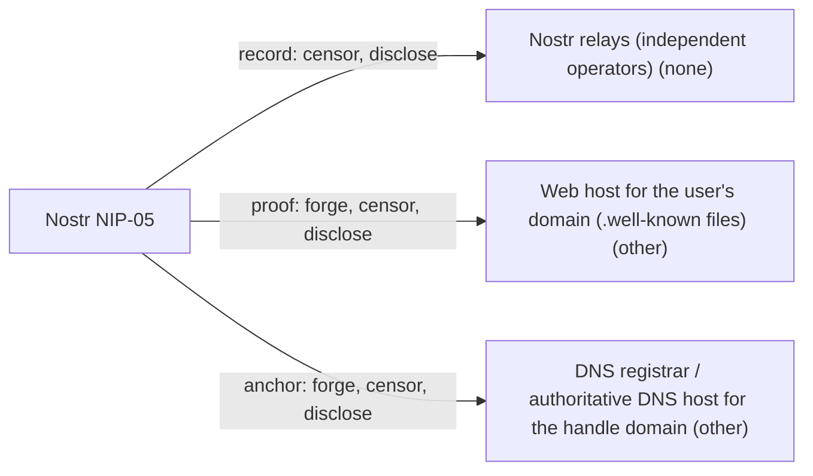

# Nostr NIP-05

## C1. Proof mechanism

Bidirectional public proof. The key signs a kind 0 profile containing `nip05: bob@example.com`, and the domain serves /.well-known/nostr.json mapping `bob` to the hex pubkey (https://github.com/nostr-protocol/nips/blob/master/05.md). No issuer, OAuth or delegation.

## C2. Verifier independence

One HTTPS GET to the domain, with no redirects allowed and CORS required for web clients. No Nostr-operated service is needed. Verification cannot happen offline, and it trusts WebPKI plus whoever controls the domain.

## C3. Platform coverage and fragility

DNS/web domains only, with no social, email or other anchor types. Fragility is low when the user owns the domain, and higher with hosted name providers (primal.net, nostrplebs, etc.), which can drop the entry. nostr.band, once a big NIP-05 name provider, was unreachable on 2026-10-01.

## C4. Key lifecycle

The binding names a single key. The domain holder can re-point a name to a new key without the old key, which makes NIP-05 the closest thing Nostr has to key migration. But the spec says clients must follow pubkeys, not identifiers, so social graphs do not move. Nostr has no merged rotation or recovery NIP: NIP-26 delegation is 'unrecommended' (https://github.com/nostr-protocol/nips/blob/master/26.md), and the NIP-41 proposals are unmerged (https://github.com/nostr-protocol/nips/pull/829, https://github.com/nostr-protocol/nips/pull/1452).

## C5. Freshness and replay

Freshness comes only from live lookup: clients 'should cease displaying' a name the domain no longer confirms. Bindings carry no timestamps, expiry or log. Clients cache results by their own rules.

## C6. Threat model

The spec says NIP-05 is 'identification, not verification'. The domain operator, registrar or web host can bind the name to any key. Clients have shipped checkmarks without fetching nostr.json at all, which let a dozen keys all claim _@hzrd149.com (https://github.com/NosFabrica/Brainstorm-UI/pull/87, fixed 2026-09-23).

## C7. Key system portability

Nostr-only. The file maps names to Nostr hex pubkeys, and the other side of the link is a signed Nostr kind 0. The JSON format could carry any 32-byte key, but the spec defines no other key types.

## C8. Adoption and status

Community NIP marked 'final', the most widely shown identity signal in Nostr. Damus (https://github.com/damus-io/damus/blob/master/damus/Features/NIP05/Models/NIP05.swift), Amethyst and Primal show it. The spec text was last substantively changed in Feb 2026.

## C9. Effort tier

Attach tier for a Nostr key holder with a domain: one static JSON file and one profile field. Migrate tier for other key systems, which must adopt a Nostr keypair.

## C10. Sovereignty

The record lives on many relays and can be self-hosted. The proof lives on one web host under one registrar, either of which can censor it or re-bind the name. Hosted name providers can see lookup metadata.

## Misfit notes

Fits 'bidirectional public proof' with the domain as anchor. One misfit: the domain side asserts a name-to-key mapping that it can rewrite at will, so in practice the domain operator is also a de facto issuer (hosted providers such as primal.net or nostrplebs assign names to users). The arrangement sits between public proof and issuer attestation, but nothing is signed. The effort tier depends on already having a Nostr key, just as with NIP-39.

## Surprises

The spec says NIP-05 is 'identification, not verification', yet clients show it as a blue-check-style badge, and some UIs drew the check without fetching nostr.json at all (fixed in Brainstorm-UI 2026-09-23). The domain owner can re-point a name to a new key without the old key, so DNS, not the Nostr key, is the stable identity root for users who rotate. Because the spec says to follow pubkeys rather than names, re-pointing does not move followers.

## Facts

| Fact | Value | Source | Date | Note |
|---|---|---|---|---|
| `proof.key_signs_claim` | yes | [link](https://github.com/nostr-protocol/nips/blob/master/05.md) | 2026-06 | The `nip05` field ('bob@example.com') is in the kind 0 metadata event signed by the key. |
| `proof.anchor_publishes_key` | yes | [link](https://github.com/nostr-protocol/nips/blob/master/05.md) | 2026-06 | https://<domain>/.well-known/nostr.json?name=<local> returns names -> lowercase hex pubkey. |
| `proof.third_party_signs_binding` | no | [link](https://github.com/nostr-protocol/nips/blob/master/05.md) | 2026-06 | Nothing is signed besides the kind 0 event. The domain asserts the mapping through HTTPS only. Hosted NIP-05 providers act as the domain (anchor), not as a separate signer. |
| `proof.uses_oauth_oidc` | no | [link](https://github.com/nostr-protocol/nips/blob/master/05.md) | 2026-06 | Static JSON file. No login step. |
| `proof.capability_delegation` | no | [link](https://github.com/nostr-protocol/nips/blob/master/05.md) | 2026-06 | A name-to-key mapping. The spec calls it 'identification, not verification'. |
| `proof.anchor_is_dns` | yes | [link](https://github.com/nostr-protocol/nips/blob/master/05.md) | 2026-06 | The anchor is a web domain, served over HTTPS at /.well-known. |
| `proof.anchor_is_email` | no | [link](https://github.com/nostr-protocol/nips/blob/master/05.md) | 2026-06 | Email-shaped identifier but resolved by HTTPS GET to the domain's nostr.json; no mailbox involved (also stated by https://www.name.com/blog/how-to-get-nostr-verified-on-a-custom-domain). |
| `proof.anchor_is_social` | no | [link](https://github.com/nostr-protocol/nips/blob/master/05.md) | 2026-06 | Domains only. Platform-hosted names (e.g. user@primal.net) are domain anchors run by a platform. |
| `verify.offline_possible` | no | [link](https://github.com/nostr-protocol/nips/blob/master/05.md) | 2026-06 | The client must make a GET to the domain's nostr.json. |
| `verify.fetches_anchor` | yes | [link](https://github.com/nostr-protocol/nips/blob/master/05.md) | 2026-06 | Live HTTPS fetch, which must not follow redirects. |
| `verify.needs_issuer_trust` | no | [link](https://github.com/nostr-protocol/nips/blob/master/05.md) | 2026-06 | No issuer key. Trust rests on the domain via WebPKI TLS. |
| `verify.needs_registry` | no | [link](https://github.com/nostr-protocol/nips/blob/master/05.md) | 2026-06 | Only the signed kind 0 and the domain's file are needed. DNS resolution is implicit, but no registry, log or chain is queried. |
| `verify.no_author_service` | yes | [link](https://github.com/nostr-protocol/nips/blob/master/05.md) | 2026-06 | No central Nostr service is involved. |
| `verify.breaks_if_api_closed` | no | [link](https://github.com/nostr-protocol/nips/blob/master/05.md) | 2026-06 | A plain static file on a domain the user can control, with no platform API. For names hosted by a provider (e.g. primal.net), verification depends on that provider continuing to serve the file. |
| `lifecycle.survives_key_rotation` | no | [link](https://github.com/nostr-protocol/nips/blob/master/05.md) | 2026-06 | The mapping names one hex key. The domain owner can re-point the name to a new key without the old key, which is the de facto Nostr 'migration'. But the spec says clients follow pubkeys, not identifiers, so follows do not move. |
| `lifecycle.explicit_revocation` | no | [link](https://github.com/nostr-protocol/nips/blob/master/05.md) | 2026-06 | Removing or changing the nostr.json entry is the only path. Clients 'should cease displaying' the identifier when the domain stops confirming it. |
| `lifecycle.expiry` | no | [link](https://github.com/nostr-protocol/nips/blob/master/05.md) | 2026-06 | No expiry. Clients cache at their own discretion, e.g. Brainstorm-UI caches 30 min (https://github.com/NosFabrica/Brainstorm-UI/pull/87). |
| `lifecycle.key_recovery` | no | [link](https://github.com/nostr-protocol/nips/blob/master/README.md) | 2026 | Nostr has no merged recovery NIP. NIP-05 lets a name be re-pointed, but the old pubkey's followers and history are not migrated. |
| `lifecycle.replay_protected` | no | [link](https://github.com/nostr-protocol/nips/blob/master/05.md) | 2026-06 | No timestamps, nonces or log. Verification is a live fetch, so a new domain owner fully controls the result. An old proof cannot be replayed, but the new owner can re-bind the name. |
| `record.transparency_log` | no | [link](https://github.com/nostr-protocol/nips/blob/master/05.md) | 2026-06 | Neither kind 0 (replaceable) nor nostr.json keeps history. |
| `record.self_hosted_possible` | yes | [link](https://github.com/nostr-protocol/nips/blob/master/05.md) | 2026-06 | The user can host nostr.json on their own domain and the kind 0 on their own relay. A registrar is still needed for the domain. |
| `record.multi_operator` | yes | [link](https://github.com/nostr-protocol/nips/blob/master/01.md) | 2026 | The kind 0 record replicates across independent relays. The nostr.json proof is on a single web host. |
| `portability.generic_key` | no | [link](https://github.com/nostr-protocol/nips/blob/master/05.md) | 2026-06 | Maps names to Nostr hex pubkeys (secp256k1 x-only), and the claim side is a signed Nostr kind 0. |
| `portability.extensible_anchors` | no | [link](https://github.com/nostr-protocol/nips/blob/master/05.md) | 2026-06 | Domains only. |
| `adoption.spec_maturity` | 2 | [link](https://github.com/nostr-protocol/nips/blob/master/05.md) | 2026-06 | Community NIP, status 'final optional'. |
| `adoption.active_2026` | yes | [link](https://github.com/nostr-protocol/nips/commits/master/05.md) | 2026-06 | Feb 2026: explicit lowercase hex requirement. Jun 2026: formatting. |
| `adoption.client_display` | yes | [link](https://github.com/damus-io/damus/blob/master/damus/Features/NIP05/Models/NIP05.swift) | 2026 | Damus fetches /.well-known/nostr.json to verify, and Amethyst has a Nip05 verifier in quartz/nip05DnsIdentifiers. Primal shows a checkmark next to verified names (https://www.name.com/blog/how-to-get-nostr-verified-on-a-custom-domain). |
| `effort.attachable` | no | [link](https://github.com/nostr-protocol/nips/blob/master/05.md) | 2026-06 | Only for Nostr keys. An existing Nostr user attaches by adding one JSON file, which is attach tier for them. |
| `effort.requires_platform_migration` | yes | [link](https://github.com/nostr-protocol/nips/blob/master/05.md) | 2026-06 | A non-Nostr key holder must adopt a Nostr keypair and kind 0 profile. |

## Sovereignty

## Operators

| Layer | Operator | Forge | Censor | Disclose | Note |
|---|---|---|---|---|---|
| record | Nostr relays (independent operators) (none) | no | yes | yes | The kind 0 is signed, so relays cannot forge it. Each relay can drop it, and they see IPs and queries. |
| proof | Web host for the user's domain (.well-known files) (other) | yes | yes | yes | Whoever serves nostr.json can map the name to a key it controls; a hosted provider can reassign names. It cannot make the victim's key claim anything. It sees every verifier's lookup (IP, name queried). |
| anchor | DNS registrar / authoritative DNS host for the handle domain (other) | yes | yes | yes | Can redirect the domain to a host that serves a different key, or seize or suspend the domain. Holds registrant data. |
