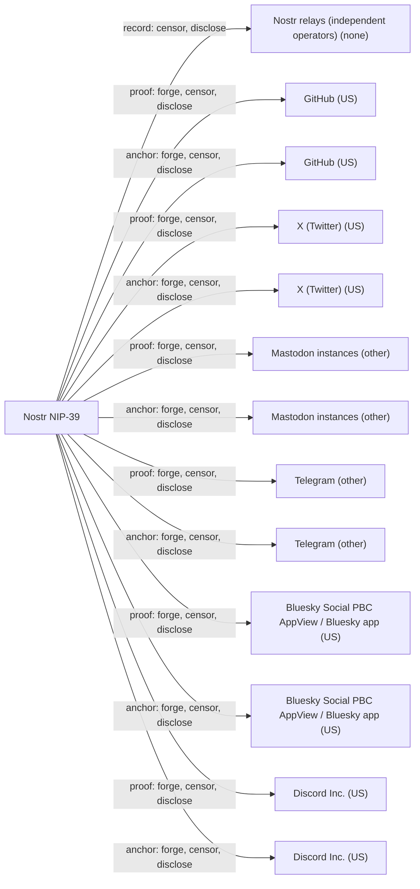

# Nostr NIP-39

## C1. Proof mechanism

Bidirectional public proof. The Nostr key signs a kind 10011 event with `i` tags such as `github:alice` plus a proof pointer. The anchor account publishes a post containing 'Verifying that I control the following Nostr public key: <npub>' (https://github.com/nostr-protocol/nips/blob/master/39.md). No OAuth, no issuer, no delegation.

## C2. Verifier independence

The verifier needs the signed event, from any relay or presented directly, and a live fetch of the post from the anchor platform. No Nostr-run service is needed, but every check depends on the platform serving the post publicly. The newly added Discord proofs can only be read by members of the server (https://github.com/nostr-protocol/nips/pull/2486).

## C3. Platform coverage and fragility

Defined anchors are GitHub, Twitter/X, Mastodon, Telegram, Bluesky and Discord. DNS and email are not covered, since DNS is NIP-05's job. Platform names are free-form strings, and users already published Bluesky and Discord claims before the spec added them. Fragility follows each platform's openness, and X is the weakest point.

## C4. Key lifecycle

Proofs name one npub, so a key change breaks every link and the user must re-post all proofs. Nostr has no merged rotation or recovery NIP. NIP-26 delegation is marked 'unrecommended: adds unnecessary burden for little gain' (https://github.com/nostr-protocol/nips/blob/master/26.md). The NIP-41 migration proposals (#158, #829, #1032, #1056, #1452) remain unmerged, and the master README index lists no key migration NIP (https://github.com/nostr-protocol/nips/blob/master/README.md). The only revocation is replacing the kind 10011 event or deleting the post.

## C5. Freshness and replay

Nothing expires, and the proof text carries no nonce or date. PR #2486 asks verifiers to accept any proof that contains the npub, whatever its wording, so old proofs stay valid forever. The kind 10011 record is replaceable, with no history or log.

## C6. Threat model

A verifier trusts that the platform shows the real account holder's post. The platform can fake the post, and a relay can withhold the event but cannot forge it. Most clients show the claim without checking it, so in practice an unverified `i` tag looks the same as a verified one. Claims are cheap to fake at the display layer.

## C7. Key system portability

Tied to Nostr keys. The proof text requires an npub, and the claim must be a BIP-340 signed Nostr event. A generic DID or ed25519 key cannot use it without a Nostr key in between.

## C8. Adoption and status

Community NIP marked 'draft optional', with active changes in 2026: moved from kind 0 to kind 10011 in Feb 2026 (https://github.com/nostr-protocol/nips/pull/2216) and unified text in Sep 2026. Uptake is modest. Alex Gleason's survey found 756 authors with `i` tags out of 5,859 with kind 10011, and only 27 of 611 proofs matched the exact spec text. Amethyst displays claims without verifying them (https://github.com/vitorpamplona/amethyst/blob/main/amethyst/src/main/java/com/vitorpamplona/amethyst/ui/screen/loggedIn/profile/header/DrawAdditionalInfo.kt).

## C9. Effort tier

Attach tier for someone who already has a Nostr key: publish one event, post one gist. Migrate tier for anyone else, who must adopt a Nostr keypair and relays. Building a verifier takes per-platform fetchers.

## C10. Sovereignty

The record sits on many independent relays, and the user can run their own relay. Each proof lives on one centralized platform (GitHub, X, Discord in the US, Telegram in the UAE/BVI), which can censor or fabricate it. Relays and platforms both see request metadata.

## Misfit notes

Fits the 'bidirectional public proof' family cleanly. It is essentially Keybase-style proofs without a sigchain or a Keybase server. The effort tier is the misfit: it is attach-tier only if 'the key system I own' is already a Nostr key, and migrate-tier otherwise. Even then the 'platform' you migrate to is only a key format plus a relay set, not an operator. Since Feb 2026 the claim also lives in a dedicated event (kind 10011), separate from the profile, so the 'identity record' and the 'claim list' are distinct records.

## Surprises

NIP-39 moved out of the kind 0 profile into kind 10011 in Feb 2026, partly because 'almost nobody supports' it, so older clients that read kind 0 miss new claims. A Sep 2026 survey found only 27 of 611 live proofs used the exact spec text, which is why the spec now says to accept any proof containing the npub. Amethyst, the main client advertising NIP-39, shows claims without verifying them, and nostr.band, the best-known verifier, was offline as of 2026-10-01. Discord was added as an anchor even though most verifiers cannot read Discord messages.

## Facts

| Fact | Value | Source | Date | Note |
|---|---|---|---|---|
| `proof.key_signs_claim` | yes | [link](https://github.com/nostr-protocol/nips/blob/master/39.md) | 2026-09-27 | The claim is an `i` tag (platform:identity, proof) inside a kind 10011 event signed by the Nostr key. Before PR #2216 (merged 2026-02-10) it was in kind 0, which is also signed. |
| `proof.anchor_publishes_key` | yes | [link](https://github.com/nostr-protocol/nips/blob/master/39.md) | 2026-09-27 | The claimed account publishes a gist, tweet, toot, Telegram message, Bluesky post or Discord message containing 'Verifying that I control the following Nostr public key: <npub>'. |
| `proof.third_party_signs_binding` | no | [link](https://github.com/nostr-protocol/nips/blob/master/39.md) | 2026-09-27 | Only the key holder (event signature) and the anchor platform (hosting the post) are involved. No issuer or attestor. |
| `proof.uses_oauth_oidc` | no | [link](https://github.com/nostr-protocol/nips/blob/master/39.md) | 2026-09-27 | The user posts the proof by hand. The spec defines no OAuth step. |
| `proof.capability_delegation` | no | [link](https://github.com/nostr-protocol/nips/blob/master/39.md) | 2026-09-27 | It is a claim of control ('I control this npub'), not a grant of authority. |
| `proof.anchor_is_dns` | no | [link](https://github.com/nostr-protocol/nips/blob/master/39.md) | 2026-09-27 | The defined platforms are github, twitter, mastodon, telegram, bluesky and discord. DNS anchoring is a separate NIP (NIP-05). |
| `proof.anchor_is_email` | no | [link](https://github.com/nostr-protocol/nips/blob/master/39.md) | 2026-09-27 | No email platform is defined. |
| `proof.anchor_is_social` | yes | [link](https://github.com/nostr-protocol/nips/blob/master/39.md) | 2026-09-27 | GitHub, Twitter/X, Mastodon, Telegram, Bluesky, Discord. |
| `verify.offline_possible` | no | [link](https://github.com/nostr-protocol/nips/blob/master/39.md) | 2026-09-27 | The proof is only a pointer (gist id, tweet id). The verifier must fetch the post from the platform to check that it contains the npub. |
| `verify.fetches_anchor` | yes | [link](https://github.com/nostr-protocol/nips/blob/master/39.md) | 2026-09-27 | For example, fetch https://gist.github.com/<identity>/<proof>. |
| `verify.needs_issuer_trust` | no | [link](https://github.com/nostr-protocol/nips/blob/master/39.md) | 2026-09-27 | No issuer key is involved. |
| `verify.needs_registry` | no | [link](https://github.com/nostr-protocol/nips/blob/master/01.md) | 2026 | The kind 10011 event authenticates itself (Schnorr signature). It can come from any relay or be presented directly. Relays are transport, not an authority that must be queried. |
| `verify.no_author_service` | yes | [link](https://github.com/nostr-protocol/nips/blob/master/39.md) | 2026-09-27 | Verification needs only the signed event and the anchor platform. Nostr has no central service run by the spec authors. |
| `verify.breaks_if_api_closed` | yes | [link](https://github.com/nostr-protocol/nips/pull/2486) | 2026-09-27 | Proofs are posts on the platform. The PR states that Discord proofs cannot be checked by clients that are not in the server. X tweet fetching already depends on an API or scraping. |
| `lifecycle.survives_key_rotation` | no | [link](https://github.com/nostr-protocol/nips/blob/master/README.md) | 2026 | The proof text names one npub. Nostr has no merged key-rotation NIP (no 41.md on master), and NIP-26 delegation is marked unrecommended. A new key needs new proofs. |
| `lifecycle.explicit_revocation` | no | [link](https://github.com/nostr-protocol/nips/blob/master/39.md) | 2026-09-27 | No revocation construct exists. The user can only publish a new replaceable kind 10011 without the tag, or delete the post. |
| `lifecycle.expiry` | no | [link](https://github.com/nostr-protocol/nips/blob/master/39.md) | 2026-09-27 | No expiry is defined. The PR asks verifiers to accept old-format proofs indefinitely. |
| `lifecycle.key_recovery` | no | [link](https://github.com/nostr-protocol/nips/pull/1452) | 2024-08 | Key migration and recovery proposals (#158, #829, #1032, #1056, #1452) are all unmerged. No 41.md exists on master as of 2026-10-01. |
| `lifecycle.replay_protected` | no | [link](https://github.com/nostr-protocol/nips/blob/master/39.md) | 2026-09-27 | Proof text has no nonce or date. The created_at of the event is not tied to the post date, and no log exists. Verification is a live fetch, so a proof left on a transferred account (e.g. a Mastodon instance domain changing hands) still verifies. |
| `record.transparency_log` | no | [link](https://github.com/nostr-protocol/nips/blob/master/01.md) | 2026 | Kind 10011 is a replaceable event. Relays keep only the latest one, so there is no append-only history. |
| `record.self_hosted_possible` | yes | [link](https://github.com/nostr-protocol/nips/blob/master/01.md) | 2026 | The user can run their own relay for the record. The proof itself lives on the anchor platform by design. |
| `record.multi_operator` | yes | [link](https://github.com/nostr-protocol/nips/pull/2486) | 2026-09-27 | The survey in the PR collected kind 10011 from 11 major relays. Clients publish the same signed event to many independent relays. |
| `portability.generic_key` | no | [link](https://github.com/nostr-protocol/nips/blob/master/39.md) | 2026-09-27 | The proof text names an npub (secp256k1 BIP-340 key), and the claim must be a signed Nostr event. |
| `portability.extensible_anchors` | yes | [link](https://github.com/nostr-protocol/nips/pull/2486) | 2026-09-27 | Platform names are open strings. The survey found Bluesky (271) and Discord (70) claims published before the spec defined them. Verifiers still need per-platform fetch logic. |
| `adoption.spec_maturity` | 2 | [link](https://github.com/nostr-protocol/nips/blob/master/39.md) | 2026-09-27 | Community NIP, labeled 'draft optional'. |
| `adoption.active_2026` | yes | [link](https://github.com/nostr-protocol/nips/commits/master/39.md) | 2026-09-27 | Two substantive changes in 2026: moved to kind 10011 (2026-02-10, #2216), and unified text plus Bluesky and Discord (2026-09-27, #2486). |
| `adoption.client_display` | no | [link](https://github.com/vitorpamplona/amethyst/blob/main/amethyst/src/main/java/com/vitorpamplona/amethyst/ui/screen/loggedIn/profile/header/DrawAdditionalInfo.kt) | 2026 | Amethyst shows each claim with an icon and opens the proof URL on tap, but does not fetch or check it. Code search found no NIP-39 or kind 10011 code in Damus or primal-web-app. nostr.band, formerly the best-known verifier, was unreachable on 2026-10-01. Smaller tools (nostr-components directory, gittr) verify. |
| `effort.attachable` | no | [link](https://github.com/nostr-protocol/nips/blob/master/39.md) | 2026-09-27 | This only works if the key you own is a Nostr secp256k1 key that publishes signed events to relays. For an existing Nostr user it is attach tier. |
| `effort.requires_platform_migration` | yes | [link](https://github.com/nostr-protocol/nips/blob/master/39.md) | 2026-09-27 | A holder of a non-Nostr key (DID, ed25519, PGP) must adopt a Nostr keypair and relay presence to use it. |

## Sovereignty

## Operators

| Layer | Operator | Forge | Censor | Disclose | Note |
|---|---|---|---|---|---|
| record | Nostr relays (independent operators) (none) | no | yes | yes | Events are Schnorr-signed, so relays cannot forge them. Any single relay can drop the kind 10011, but the user can publish to others. Relays see client IPs and query patterns. |
| proof | GitHub (US) | yes | yes | yes | GitHub could plant a gist in user X's account naming an attacker-controlled npub. It cannot make the victim's key sign anything. Proof and anchor are the same operator. |
| anchor | GitHub (US) | yes | yes | yes | Same as the proof layer: GitHub controls the account and can bind it to a key it controls. |
| proof | X (Twitter) (US) | yes | yes | yes | Tweet-based proof. Same analysis as github. Verification needs X's API or scraping. |
| anchor | X (Twitter) (US) | yes | yes | yes | Controls the account. |
| proof | Mastodon instances (other) | yes | yes | yes | The instance admin controls posts and accounts on that instance. |
| anchor | Mastodon instances (other) | yes | yes | yes | Instance admin. |
| proof | Telegram (other) | yes | yes | yes | The proof is a public channel message. |
| anchor | Telegram (other) | yes | yes | yes | Controls the account. |
| proof | Bluesky Social PBC AppView / Bluesky app (US) | yes | yes | yes | The proof is a Bluesky post fetched through the AppView. Forge is 'yes' if the user's PDS is Bluesky-hosted. A self-hosted PDS would reduce this, which is not analysed here. |
| anchor | Bluesky Social PBC AppView / Bluesky app (US) | yes | yes | yes | Handle and account on Bluesky-hosted infrastructure. |
| proof | Discord Inc. (US) | yes | yes | yes | Messages are readable only by server members, so most verifiers cannot check them at all (PR #2486). |
| anchor | Discord Inc. (US) | yes | yes | yes | Controls the account. |
