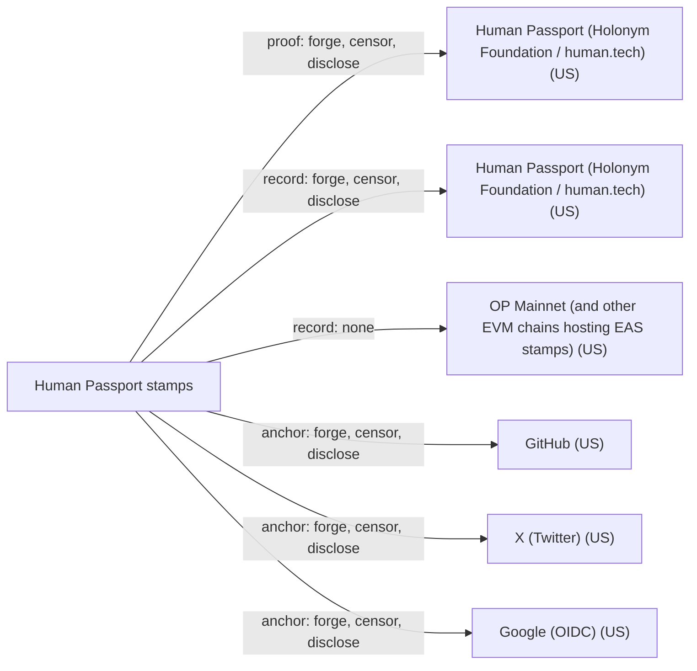

# Human Passport stamps

## C1. Proof mechanism

Issuer attestation after OAuth: the user logs into GitHub/X/Google etc. and Human Passport's IAM server issues an EIP-712-signed VC with subject did:pkh:eip155:1:<address>, a provider name, and hashed nullifiers instead of the account id (https://github.com/passportxyz/passport/blob/main/identity/src/credentials.ts). The wallet signs only a session/challenge naming the provider type (https://github.com/passportxyz/passport/blob/main/identity/src/challenge.ts).

## C2. Verifier independence

A stamp VC can be checked offline against the issuer key, but verifiers must trust Human Passport as issuer, and typical integration calls its Stamps/Scorer API or reads EAS attestations onchain (https://github.com/passportxyz/eas-proxy/blob/main/docs/00-onchain-data.md).

## C3. Platform coverage and fragility

Many social and web3 providers (GitHub, X, Google, Discord, LinkedIn, Steam, ENS, ZK Email, biometrics/KYC via Holonym) but no DNS anchor (https://github.com/passportxyz/passport/tree/main/platforms/src). Each stamp depends on the platform's OAuth/API for issuance and 90-day renewal.

## C4. Key lifecycle

Stamps are tied to one Ethereum address and do not survive moving to another address; deduplication means a GitHub account counts only for the first address until that stamp expires (https://docs.passport.human.tech/building-with-passport/stamps/major-concepts/deduplicating-stamps). Revocation exists only as an operator-held list checked by IAM (https://github.com/passportxyz/passport/blob/main/iam/src/utils/revocations.ts).

## C5. Freshness and replay

All stamps expire after 90 days (https://docs.passport.human.tech/building-with-passport/stamps/major-concepts/expirations), which bounds replay after an account changes hands. There is no transparency log; optional onchain stamps are public on EVM chains.

## C6. Threat model

The issuer can mint any stamp for any address; the anchor platform can impersonate via OAuth. Because the VC hides the account identity behind nullifiers, a third party cannot learn which GitHub account is linked, by design: it is a Sybil-resistance signal, not an identity link.

## C7. Key system portability

Only Ethereum addresses (did:pkh eip155) are supported subjects; no ed25519 or arbitrary DID.

## C8. Adoption and status

Vendor product, formerly Gitcoin Passport; Holonym Foundation completed the acquisition in Dec 2024 and announced it in Feb 2025 as Human Passport under human.tech (https://passport.human.tech/blog/from-gitcoin-passport-to-human-passport-we-re-now-part-of-human-tech). Actively developed into 2026-09.

## C9. Effort tier

Attach tier for Ethereum key holders only; everyone else would have to create an Ethereum wallet, which is effectively migration.

## C10. Sovereignty

Human Passport (Holonym Foundation, Wilmington DE per privacy policy https://passport.human.tech/policy) operates the issuer and the stamp store; anchors are US platforms. Optional onchain copies sit on public EVM chains such as OP Mainnet.

## Misfit notes

Fits 'issuer attestation after OAuth' structurally, but it is not an OOBTA link in the study's sense: the credential deliberately omits which account was verified (only a provider name and hashed nullifiers), so a verifier learns 'this address controls some GitHub account', not 'this address is github.com/alice'. It is a Sybil score, not a sameness proof. Also restricted to Ethereum addresses, so 'attach' only applies to EVM key systems.

## Surprises

Stamps do not reveal the linked account, only a hash, so they cannot be used to show that a key belongs to a specific GitHub user. The issuer moved from did:key/Ed25519 (still shown in docs and prod config) to EIP-712 did:ethr signing in code. Docs (updated 2026-04) still say stamps are stored on Ceramic, while the app reads them from Passport's own 'ceramic-cache' API. Deduplication is first-come per scorer, so the same GitHub account can be scored differently by different apps.

## Facts

| Fact | Value | Source | Date | Note |
|---|---|---|---|---|
| `proof.key_signs_claim` | no | [link](https://github.com/passportxyz/passport/blob/main/identity/src/challenge.ts) | 2025-03-31 | The wallet signs a session/challenge such as 'I commit that this stamp is my unique and only <provider> verification' with a nonce; it names the platform type, not the specific account. |
| `proof.anchor_publishes_key` | no | [link](https://github.com/passportxyz/passport/blob/main/identity/src/credentials.ts) | 2025-05-07 | The anchor account publishes nothing; the IAM server checks it via OAuth/API. |
| `proof.third_party_signs_binding` | yes | [link](https://github.com/passportxyz/passport/blob/main/identity/src/credentials.ts) | 2025-05-07 | Human Passport's IAM server signs an EIP-712 VC (issuer did:ethr from its key; prod config still lists a did:key issuer) whose subject is did:pkh:eip155:1:<address>. |
| `proof.uses_oauth_oidc` | yes | [link](https://passport.human.tech/privacy) | 2026 | Web2 stamps use temporary OAuth login data that is discarded after validation. |
| `proof.capability_delegation` | no | [link](https://github.com/passportxyz/passport/blob/main/identity/src/credentials.ts) | 2025-05-07 | The VC asserts provider + hashed nullifiers for an address; not a capability. |
| `proof.anchor_is_dns` | no | [link](https://github.com/passportxyz/passport/tree/main/platforms/src) | 2026-09 | Provider list (GitHub, X, Google, Discord, LinkedIn, ENS, Steam, ZKEmail, ...) has no domain/DNS stamp. |
| `proof.anchor_is_email` | no | [link](https://github.com/passportxyz/passport/blob/main/platforms/src/ZKEmail/Providers-config.ts) | 2025-12-01 | No stamp binds a named email address; the ZK Email stamp proves receipt of Uber/Amazon emails, and the Google stamp proves a Google account but stores only a hash. |
| `proof.anchor_is_social` | yes | [link](https://github.com/passportxyz/passport/tree/main/platforms/src) | 2026-09 | GitHub, X, Discord, LinkedIn, Google, Steam providers exist. |
| `verify.offline_possible` | yes | [link](https://github.com/passportxyz/passport/blob/main/identity/src/credentials.ts) | 2025-05-07 | A stamp is a self-contained EIP-712 signed VC verifiable against the issuer DID; in practice integrators call the Passport API or read onchain attestations. |
| `verify.fetches_anchor` | no | [link](https://github.com/passportxyz/passport/blob/main/identity/src/credentials.ts) | 2025-05-07 | Only the issuer contacts the platform at issuance; verifiers check the issuer signature. |
| `verify.needs_issuer_trust` | yes | [link](https://github.com/passportxyz/passport/blob/main/identity/src/issuers.ts) | 2025-07-07 | Verifier must trust Human Passport's issuer keys (rotating key versions). |
| `verify.needs_registry` | no | [link](https://docs.passport.human.tech/overview/key-terms) | 2026-04-07 | Not required for a presented VC; onchain stamps (EAS) require reading a chain, and stamps are normally fetched from Passport's store. |
| `verify.no_author_service` | yes | [link](https://github.com/passportxyz/passport/blob/main/identity/src/credentials.ts) | 2025-05-07 | Possible if the holder presents the VC and the verifier pins the issuer key; the default integration uses Human Passport's Stamps/Scorer API. |
| `verify.breaks_if_api_closed` | yes | [link](https://docs.passport.human.tech/building-with-passport/stamps/major-concepts/expirations) | 2026 | Existing stamps stay valid until 90-day expiry, but they cannot be renewed if the platform API closes, so links lapse within 90 days. |
| `lifecycle.survives_key_rotation` | no | [link](https://docs.passport.human.tech/building-with-passport/stamps/major-concepts/deduplicating-stamps) | 2026 | Stamps are bound to one Ethereum address; moving to another address means waiting for expiry and reverifying. |
| `lifecycle.explicit_revocation` | yes | [link](https://github.com/passportxyz/passport/blob/main/iam/src/utils/revocations.ts) | 2025-05-07 | Operator-side only: IAM filters credentials against a revocation list held by the Scorer, and the scorer also keeps bans. The VC has no credentialStatus, and users cannot revoke. |
| `lifecycle.expiry` | yes | [link](https://docs.passport.human.tech/building-with-passport/stamps/major-concepts/expirations) | 2026 | Offchain and onchain stamps expire 90 days after issuance. |
| `lifecycle.key_recovery` | no | [link](https://docs.passport.human.tech/building-with-passport/stamps/major-concepts/deduplicating-stamps) | 2026 | No recovery for the address; the only path is to reverify stamps on a new wallet after the old ones expire. |
| `lifecycle.replay_protected` | yes | [link](https://docs.passport.human.tech/building-with-passport/stamps/major-concepts/expirations) | 2026 | 90-day expiry plus nonce-bearing challenges; a stale stamp cannot outlive account transfer by more than 90 days. |
| `record.transparency_log` | no | [link](https://docs.passport.human.tech/overview/key-terms) | 2026-04-07 | Default stamps live in Passport's store; optional onchain EAS attestations are on public chains but are not the default record. |
| `record.self_hosted_possible` | no | [link](https://github.com/passportxyz/passport/blob/main/identity/src/credentials.ts) | 2025-05-07 | Stamps must be issued and signed by Human Passport's IAM. |
| `record.multi_operator` | no | [link](https://github.com/passportxyz/passport/blob/main/app/.env-prod) | 2026-06-08 | Stamps are served from Passport's scorer API ('ceramic-cache'); the docs still say Ceramic. Optional onchain copies exist on several EVM chains. |
| `portability.generic_key` | no | [link](https://github.com/passportxyz/passport/blob/main/identity/src/credentials.ts) | 2025-05-07 | Subject is always did:pkh:eip155:1:<Ethereum address>. |
| `portability.extensible_anchors` | yes | [link](https://github.com/passportxyz/passport/tree/main/platforms/src) | 2026-09 | New providers are added as platform modules in the operator's code, without any spec; only the operator can add them. |
| `adoption.spec_maturity` | 0 | [link](https://github.com/passportxyz/passport) | 2026-09-27 | Vendor-only product; no external spec. |
| `adoption.active_2026` | yes | [link](https://github.com/passportxyz/passport) | 2026-09-27 | Commits through 2026-09-27. |
| `adoption.client_display` | yes | [link](https://docs.passport.human.tech/overview/key-terms) | 2026-04-07 | The Passport app and integrator dashboards display verified stamps and scores for an address (but not the account name). |
| `effort.attachable` | yes | [link](https://github.com/passportxyz/passport/blob/main/identity/src/credentials.ts) | 2025-05-07 | Only if the existing key is an Ethereum address; any EOA can collect stamps. |
| `effort.requires_platform_migration` | no | [link](https://github.com/passportxyz/passport/blob/main/identity/src/credentials.ts) | 2025-05-07 | Works with an existing Ethereum wallet; no new identifier is minted, though Passport's app and issuer are required. |

## Sovereignty

## Operators

| Layer | Operator | Forge | Censor | Disclose | Note |
|---|---|---|---|---|---|
| proof | Human Passport (Holonym Foundation / human.tech) (US) | yes | yes | yes | The IAM issuer key signs every stamp and could sign one for any address. Per its policy it collects IP/device metadata, though OAuth data is discarded. |
| record | Human Passport (Holonym Foundation / human.tech) (US) | yes | yes | yes | Stamps are stored and served by Passport's scorer API; the operator can also ban or revoke stamps. |
| record | OP Mainnet (and other EVM chains hosting EAS stamps) (US) | no | no | no | Optional onchain EAS copies: the chain cannot forge the attester's signature. Censorship would need sequencer collusion beyond forced inclusion, and all data is public anyway. |
| anchor | GitHub (US) | yes | yes | yes | Platform can complete OAuth as any account, or close the account or API, stopping renewals. |
| anchor | X (Twitter) (US) | yes | yes | yes | Same as github. |
| anchor | Google (OIDC) (US) | yes | yes | yes | Same as github. |
