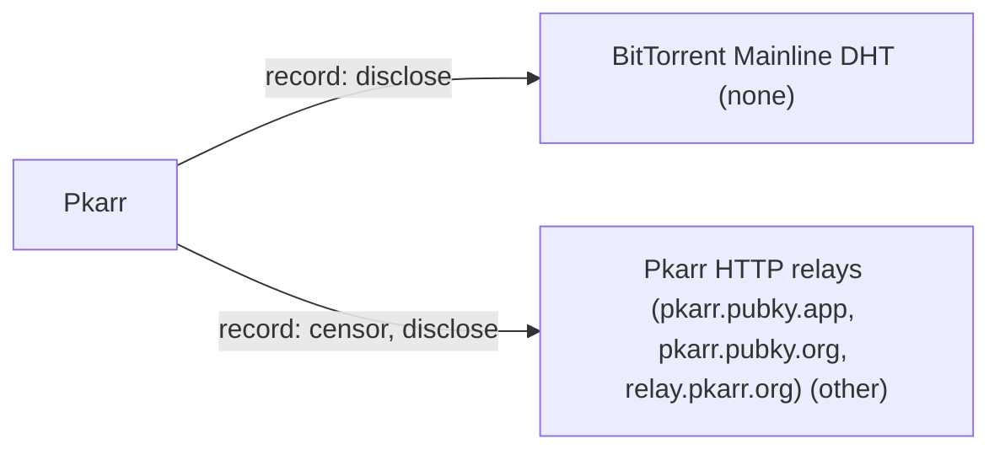

# Pkarr

## C1. Proof mechanism

Pkarr has no out-of-band proof. An ed25519 key signs a compressed DNS packet (pubkey || sig || microsecond timestamp || DNS packet, under 1000 bytes) that is stored as a BEP44 mutable item on Mainline DHT (https://github.com/pubky/pkarr/blob/main/design/base.md). The key is the root and DNS records are content, so it is the inverse of anchoring a key to an existing account.

## C2. Verifier independence

Verification needs only the public key and the signed packet. A presented packet verifies offline. Getting the current packet means a DHT get on sha1(pubkey) or an optional HTTP relay (https://github.com/pubky/pkarr/blob/main/design/relays.md). No issuer and no author service is required.

## C3. Platform coverage and fragility

It supports no anchors: no DNS domain, email, or social platform. ICANN domains appear only as HTTPS (RFC 9460) endpoint targets for reaching a server (https://github.com/pubky/pkarr/blob/main/design/endpoints.md), not as identity anchors. Nothing depends on a platform API, so there is no platform fragility.

## C4. Key lifecycle

The key is the name. There is no rotation, succession, revocation or recovery: a lost or compromised key means a lost or compromised name. The only update is publishing a newer packet.

## C5. Freshness and replay

The signed timestamp doubles as the BEP44 sequence number, and nodes and relays reject older packets. Records are ephemeral: the DHT drops them after hours unless republished (https://github.com/pubky/pkarr). Anyone holding an old signed packet can republish it once newer copies have expired from the DHT.

## C6. Threat model

No operator can forge a packet without the secret key. DHT nodes and relays can refuse to store or serve packets, or return stale ones, and an eclipse or Sybil attack on the keyspace near sha1(pubkey) could censor a specific key. Relays and DHT nodes see requester IPs.

## C7. Key system portability

It works only with raw ed25519 keys and never anchors other key types. did:dht (DIF, https://did-dht.com/) builds a DID document as TXT records on the same Mainline DHT/BEP44 mechanism, so pkarr is a substrate for a DID method rather than a linker.

## C8. Adoption and status

It is actively maintained by Synonym/Pubky: v8.0.2 released 2026-09-23 (https://github.com/pubky/pkarr/releases), with pkdns as a DNS resolver for pkarr names. The spec is vendor design docs with no standards track. The derived did:dht is at DIF.

## C9. Effort tier

Attach tier for anyone already holding ed25519 keys: sign and publish a packet. It gives you a self-certifying, DNS-addressable name, not a link to an existing trusted account.

## C10. Sovereignty

Records live on Mainline DHT, about 10M nodes with no single operator. Optional relays (pkarr.pubky.app, pkarr.pubky.org, relay.pkarr.org) only forward self-signed packets. Pkarr has no anchor layer at all.

## Misfit notes

Pkarr fits none of the three proof families because it has no anchor. It is the inverse of OOBTA: the self-certifying key is the root of trust and DNS records are its content. A user could put a TXT record naming a GitHub handle in a packet, but nothing defines or verifies it, and GitHub would still need to publish the key for a bidirectional proof. Pkarr is better mapped as a record/discovery substrate, comparable to a DID method's record layer (did:dht uses it), than as a linkage protocol. Effort tier would be attach, but it attaches a name, not a link.

## Surprises

Records disappear from the DHT within hours unless someone republishes them, so a pkarr 'domain' needs a live republisher. Anyone holding an old signed packet can republish it, so replay protection depends on the DHT still holding the newer one. The 'TLD' is the 52-character z-base32 key. The did:dht DID method is built on pkarr's mechanism but uses seconds, not pkarr's microseconds, for seq.

## Facts

| Fact | Value | Source | Date | Note |
|---|---|---|---|---|
| `proof.key_signs_claim` | no | [link](https://github.com/pubky/pkarr/blob/main/design/base.md) | 2026-09 | The key signs a DNS packet (A/AAAA/TXT/HTTPS records) about itself. No record type names an external account as an identity claim. An HTTPS record target may point to an ICANN domain, but only as an endpoint. |
| `proof.anchor_publishes_key` | no | [link](https://github.com/pubky/pkarr/blob/main/design/base.md) | 2026-09 | No external anchor is involved. The public key itself is the TLD. |
| `proof.third_party_signs_binding` | no | [link](https://github.com/pubky/pkarr/blob/main/design/base.md) | 2026-09 | Packets are self-signed by the ed25519 key, and relays only verify and forward them. |
| `proof.uses_oauth_oidc` | no | [link](https://github.com/pubky/pkarr/blob/main/design/relays.md) | 2026-09 | Publishing is an unauthenticated DHT put or relay PUT of a self-signed packet. |
| `proof.capability_delegation` | no | [link](https://github.com/pubky/pkarr/blob/main/design/base.md) | 2026-09 | No delegation semantics. The packet holds DNS resource records. |
| `proof.anchor_is_dns` | no | [link](https://github.com/pubky/pkarr/blob/main/design/endpoints.md) | 2026-09 | The inverse holds: the key becomes a DNS-like TLD. No ICANN domain is anchored to the key or verified. ICANN domains appear only as HTTPS endpoint targets. |
| `proof.anchor_is_email` | no | [link](https://github.com/pubky/pkarr/blob/main/design/base.md) | 2026-09 | Not supported. |
| `proof.anchor_is_social` | no | [link](https://github.com/pubky/pkarr/blob/main/design/base.md) | 2026-09 | Not supported. |
| `verify.offline_possible` | yes | [link](https://github.com/pubky/pkarr/blob/main/design/base.md) | 2026-09 | A presented SignedPacket (pubkey, sig, timestamp, DNS packet) can be checked offline. Knowing it is the latest version needs a DHT lookup. No external link exists to check. |
| `verify.fetches_anchor` | no | [link](https://github.com/pubky/pkarr/blob/main/design/base.md) | 2026-09 | There is no anchor to fetch. |
| `verify.needs_issuer_trust` | no | [link](https://github.com/pubky/pkarr/blob/main/design/base.md) | 2026-09 | The signature is verified directly against the public key. |
| `verify.needs_registry` | no | [link](https://github.com/pubky/pkarr/blob/main/design/base.md) | 2026-09 | Not required to check a presented packet. Discovering the record or its freshness means a Mainline DHT (or relay) lookup. |
| `verify.no_author_service` | yes | [link](https://github.com/pubky/pkarr/blob/main/design/base.md) | 2026-09 | Resolution goes directly over the Mainline DHT (BEP44). Synonym-run relays are optional and needed only in UDP-less environments such as browsers. |
| `verify.breaks_if_api_closed` | no | [link](https://github.com/pubky/pkarr/blob/main/design/base.md) | 2026-09 | No anchor platform API is involved. |
| `lifecycle.survives_key_rotation` | no | [link](https://github.com/pubky/pkarr/blob/main/design/base.md) | 2026-09 | The public key is the name, and the spec defines no rotation or succession. A new key is a new identity. |
| `lifecycle.explicit_revocation` | no | [link](https://github.com/pubky/pkarr/blob/main/design/base.md) | 2026-09 | The only option is to publish a newer packet (higher timestamp) that overwrites records. There is no revocation or tombstone mechanism. |
| `lifecycle.expiry` | yes | [link](https://github.com/pubky/pkarr) | 2026-09-23 | README: records are ephemeral, the DHT drops them after hours, so republish periodically. Records also carry DNS TTLs. |
| `lifecycle.key_recovery` | no | [link](https://github.com/pubky/pkarr/blob/main/design/base.md) | 2026-09 | No recovery is defined. Losing the ed25519 secret key means losing the name. |
| `lifecycle.replay_protected` | yes | [link](https://github.com/pubky/pkarr/blob/main/design/base.md) | 2026-09 | The signed microsecond timestamp acts as the BEP44 seq, and older packets are rejected (relay 409). Caveat: anyone can republish an old signed packet if the DHT has forgotten the newer one. |
| `record.transparency_log` | no | [link](https://github.com/pubky/pkarr/blob/main/design/base.md) | 2026-09 | The DHT keeps only the latest mutable item, with no history. |
| `record.self_hosted_possible` | yes | [link](https://github.com/pubky/pkarr/blob/main/design/base.md) | 2026-09 | The user's own client can put directly to Mainline DHT with no operator account. |
| `record.multi_operator` | yes | [link](https://github.com/pubky/pkdns) | 2026-03-23 | Mainline DHT has about 10M nodes, and records are stored on several nodes near sha1(pubkey). |
| `portability.generic_key` | no | [link](https://github.com/pubky/pkarr/blob/main/design/base.md) | 2026-09 | Only ed25519 keys work, and the key is its own identifier. It does not anchor other keys or DIDs, though did:dht (DIF) layers a DID document on top as TXT records. |
| `portability.extensible_anchors` | no | [link](https://github.com/pubky/pkarr/blob/main/design/base.md) | 2026-09 | There is no anchor concept. Arbitrary TXT records could carry claims, but nothing defines or verifies them. |
| `adoption.spec_maturity` | 0 | [link](https://github.com/pubky/pkarr/tree/main/design) | 2026-09 | Design docs live in the vendor (Synonym/Pubky) repo. The derived did:dht method is a DIF-hosted spec (https://did-dht.com/), which would rate 2. |
| `adoption.active_2026` | yes | [link](https://github.com/pubky/pkarr/releases) | 2026-09-23 | v8.0.2 was released 2026-09-23. |
| `adoption.client_display` | no | [link](https://github.com/pubky/pkarr/blob/main/design/base.md) | 2026-09 | There is no external-account link to display. |
| `effort.attachable` | yes | [link](https://github.com/pubky/pkarr/blob/main/design/base.md) | 2026-09 | Any ed25519 keypair you already hold can sign and publish a packet, with no registration. |
| `effort.requires_platform_migration` | no | [link](https://github.com/pubky/pkarr/blob/main/design/base.md) | 2026-09 | No account or platform is needed, only an ed25519 key and DHT access. |

## Sovereignty

## Operators

| Layer | Operator | Forge | Censor | Disclose | Note |
|---|---|---|---|---|---|
| record | BitTorrent Mainline DHT (none) | no | no | yes | No single operator. Individual nodes can drop records, and a targeted eclipse/Sybil attack could censor a key. Nodes see requester IPs. |
| record | Pkarr HTTP relays (pkarr.pubky.app, pkarr.pubky.org, relay.pkarr.org) (other) | no | yes | yes | Relays verify signatures, so they cannot forge, but they can refuse or serve stale packets. They log client IPs. Optional for native clients. |
