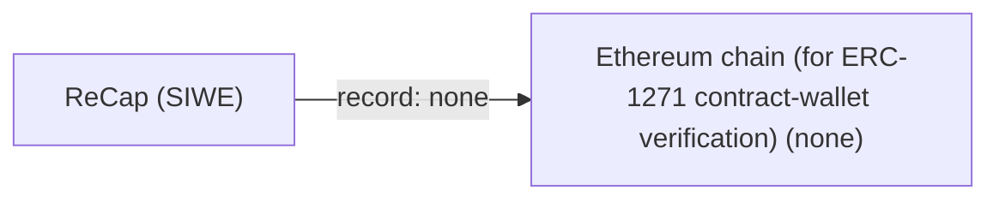

# ReCap (SIWE)

## C1. Proof mechanism

ReCap is not identity anchoring. An Ethereum account signs a SIWE message that delegates scoped capabilities to a relying party URI, which can be a did:key session key, as Lit's lit:session:<pubkey> does (https://eips.ethereum.org/EIPS/eip-5573, https://spark.litprotocol.com/session-sig-pt-2/). No external account is named or proven.

## C2. Verifier independence

EOA signatures verify offline via ecrecover. Contract wallets need an ERC-1271 call on the stated chain (https://eips.ethereum.org/EIPS/eip-4361). No issuer or anchor is involved.

## C3. Platform coverage and fragility

No platforms are covered. The SIWE domain is the requester's domain, not the user's anchor.

## C4. Key lifecycle

No revocation, rotation or recovery is defined. EOA keys are permanent; contract wallets can rotate, but ERC-1271 checks current state.

## C5. Freshness and replay

The SIWE nonce, issued-at and optional expiration give replay protection for the sign-in. Expiry is optional in the spec, though implementations such as Lit use short-lived (24h default) session signatures.

## C6. Threat model

It defends against over-broad sign-in consent by showing the user a human-readable summary of the capabilities. It does nothing about proving the same controller across accounts.

## C7. Key system portability

The issuer side is Ethereum-only. The delegee side accepts any URI, including DIDs.

## C8. Adoption and status

Draft ERC, last edited 2024-03-08 (https://github.com/ethereum/ERCs/commits/master/ERCS/erc-5573.md). It is used by WalletConnect/Reown One-Click Auth (https://docs.walletconnect.network/wallet-sdk/web/one-click-auth) and Lit Protocol session sigs.

## C9. Effort tier

Migrate tier: you need an Ethereum account as the root of authority.

## C10. Sovereignty

There are no operators for EOAs. Contract wallets depend on the chain (public, multi-operator) for verification.

## Misfit notes

Outside the OOBTA map. It is capability delegation from a self-certifying key (an Ethereum account) to a session key or app, with no out-of-band anchor at all. If it belongs anywhere, it sits beside UCAN as delegation substrate. It could only become anchoring if combined with something like ENS or SIWE domain binding.

## Surprises

Despite 'Sign-In' in the name, ReCap proves nothing about who you are outside Ethereum. It is OAuth-style authorization layered on wallet login. The spec has been an untouched Draft since March 2024 while shipping in WalletConnect's default auth flow.

## Facts

| Fact | Value | Source | Date | Note |
|---|---|---|---|---|
| `proof.key_signs_claim` | no | [link](https://raw.githubusercontent.com/ethereum/ERCs/master/ERCS/erc-5573.md) | 2024-03-08 | The Ethereum key signs a SIWE message naming the relying party (domain/URI) and delegated resources, not an account or domain that the signer owns. |
| `proof.anchor_publishes_key` | no | [link](https://raw.githubusercontent.com/ethereum/ERCs/master/ERCS/erc-5573.md) | 2024-03-08 | No external anchor publishes anything. |
| `proof.third_party_signs_binding` | no | [link](https://raw.githubusercontent.com/ethereum/ERCs/master/ERCS/erc-5573.md) | 2024-03-08 | Only the Ethereum account signs. |
| `proof.uses_oauth_oidc` | no | [link](https://raw.githubusercontent.com/ethereum/ERCs/master/ERCS/erc-5573.md) | 2024-03-08 | Analogous to OIDC+OAuth2 by design, but it uses wallet signatures, not an OAuth flow. |
| `proof.capability_delegation` | yes | [link](https://raw.githubusercontent.com/ethereum/ERCs/master/ERCS/erc-5573.md) | 2024-03-08 | 'I further authorize the stated URI to perform the following actions on my behalf'; the URI may be a did:key session key. |
| `proof.anchor_is_dns` | no | [link](https://raw.githubusercontent.com/ethereum/ERCs/master/ERCS/erc-5573.md) | 2024-03-08 | The SIWE domain is the requesting relying party, not an anchor the user controls. |
| `proof.anchor_is_email` | no | [link](https://raw.githubusercontent.com/ethereum/ERCs/master/ERCS/erc-5573.md) | 2024-03-08 | None. |
| `proof.anchor_is_social` | no | [link](https://raw.githubusercontent.com/ethereum/ERCs/master/ERCS/erc-5573.md) | 2024-03-08 | None. |
| `verify.offline_possible` | yes | [link](https://eips.ethereum.org/EIPS/eip-4361) | 2024 | EOA signatures verify via ERC-191/ecrecover offline; contract wallets need an ERC-1271 call on the stated chain. |
| `verify.fetches_anchor` | no | [link](https://eips.ethereum.org/EIPS/eip-4361) | 2024 | No anchor. |
| `verify.needs_issuer_trust` | no | [link](https://raw.githubusercontent.com/ethereum/ERCs/master/ERCS/erc-5573.md) | 2024-03-08 | The account's own signature is the root. |
| `verify.needs_registry` | no | [link](https://eips.ethereum.org/EIPS/eip-4361) | 2024 | Not for EOAs; contract-wallet (ERC-1271) verification queries chain state. |
| `verify.no_author_service` | yes | [link](https://raw.githubusercontent.com/ethereum/ERCs/master/ERCS/erc-5573.md) | 2024-03-08 | There is a deterministic verification algorithm and no author-run service. |
| `verify.breaks_if_api_closed` | no | [link](https://raw.githubusercontent.com/ethereum/ERCs/master/ERCS/erc-5573.md) | 2024-03-08 | No anchor platform. |
| `lifecycle.survives_key_rotation` | no | [link](https://eips.ethereum.org/EIPS/eip-4361) | 2024 | EOA keys cannot rotate. For contract wallets, ERC-1271 checks current state, so old signatures may stop validating. |
| `lifecycle.explicit_revocation` | no | [link](https://raw.githubusercontent.com/ethereum/ERCs/master/ERCS/erc-5573.md) | 2024-03-08 | Revocation is not addressed in the spec. |
| `lifecycle.expiry` | no | [link](https://eips.ethereum.org/EIPS/eip-4361) | 2024 | Expiration Time is OPTIONAL in SIWE. Implementations such as Lit default to 24h, but the spec does not require it. |
| `lifecycle.key_recovery` | no | [link](https://raw.githubusercontent.com/ethereum/ERCs/master/ERCS/erc-5573.md) | 2024-03-08 | Not defined. |
| `lifecycle.replay_protected` | yes | [link](https://eips.ethereum.org/EIPS/eip-4361) | 2024 | The SIWE nonce, issued-at, and optional expiration/not-before fields. |
| `record.transparency_log` | no | [link](https://raw.githubusercontent.com/ethereum/ERCs/master/ERCS/erc-5573.md) | 2024-03-08 | The signed message is held by the relying party. |
| `record.self_hosted_possible` | yes | [link](https://raw.githubusercontent.com/ethereum/ERCs/master/ERCS/erc-5573.md) | 2024-03-08 | No operator is needed for EOAs. |
| `record.multi_operator` | no | [link](https://raw.githubusercontent.com/ethereum/ERCs/master/ERCS/erc-5573.md) | 2024-03-08 | No replicated record (except chain state for contract wallets). |
| `portability.generic_key` | no | [link](https://eips.ethereum.org/EIPS/eip-4361) | 2024 | The issuer must be an Ethereum account (secp256k1 EOA or ERC-1271 contract); only the delegee URI can be a generic DID. |
| `portability.extensible_anchors` | no | [link](https://raw.githubusercontent.com/ethereum/ERCs/master/ERCS/erc-5573.md) | 2024-03-08 | No anchor concept; resource namespaces are extensible, but those are capabilities, not anchors. |
| `adoption.spec_maturity` | 1 | [link](https://eips.ethereum.org/EIPS/eip-5573) | 2024-03-08 | ERC-5573 is in Draft status; its base, ERC-4361, is Final. |
| `adoption.active_2026` | no | [link](https://github.com/ethereum/ERCs/commits/master/ERCS/erc-5573.md) | 2024-03-08 | Last spec change 2024-03-08; I did not check whether implementations (Reown One-Click Auth, Lit) changed in 2025-26. |
| `adoption.client_display` | no | [link](https://docs.walletconnect.network/wallet-sdk/web/one-click-auth) | 2025 | Wallets (WalletConnect/Reown) render the ReCap statement at signing time, but no client displays a verified key-to-account link. |
| `effort.attachable` | no | [link](https://eips.ethereum.org/EIPS/eip-4361) | 2024 | Only attaches if your key system is already an Ethereum account. |
| `effort.requires_platform_migration` | yes | [link](https://eips.ethereum.org/EIPS/eip-4361) | 2024 | The root identity must be an Ethereum account. |

## Sovereignty

## Operators

| Layer | Operator | Forge | Censor | Disclose | Note |
|---|---|---|---|---|---|
| record | Ethereum chain (for ERC-1271 contract-wallet verification) (none) | no | no | no | Only for ERC-1271 contract wallets; the chain holds public state, and EOAs need no operator. |
