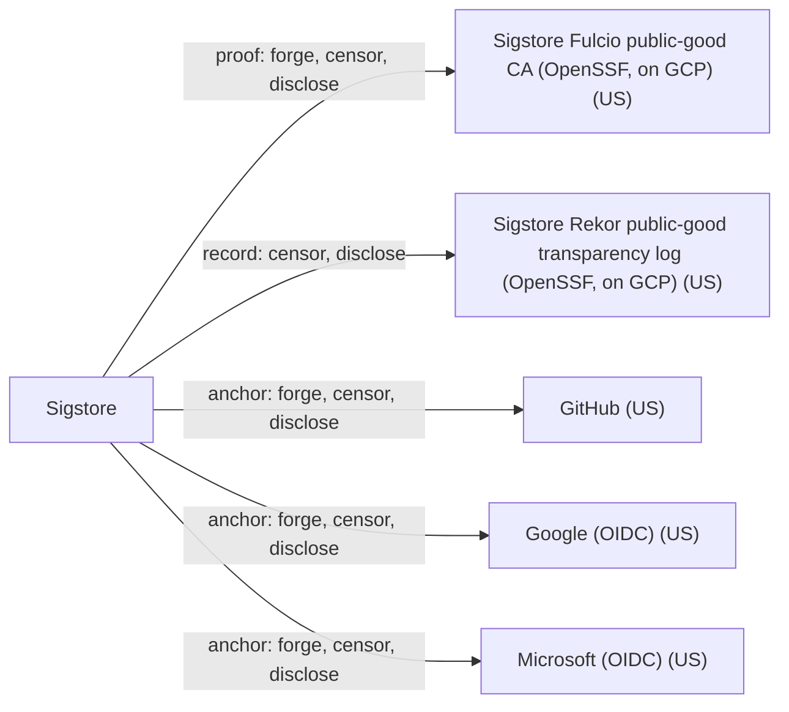

# Sigstore

## C1. Proof mechanism

Issuer attestation after OIDC: the client proves possession of a key by signing the OIDC subject, and Fulcio signs a 10-minute X.509 cert binding that key to the email or workflow URI (https://github.com/sigstore/fulcio/blob/main/docs/how-certificate-issuing-works.md). The anchor never publishes anything naming the key.

## C2. Verifier independence

Verification is offline-capable from a bundle (cert, SCT, inclusion proof, timestamp) plus a trusted root (https://github.com/sigstore/architecture-docs/blob/main/client-spec.md). The verifier must trust Fulcio, the CT log and Rekor/TSA keys distributed via Sigstore's TUF root; it never contacts the IdP.

## C3. Platform coverage and fragility

Anchors are OIDC identities: email via Google/Microsoft/GitHub login, CI workflow identities (GitHub Actions, GitLab), and SPIFFE (https://github.com/sigstore/architecture-docs/blob/main/sigstore-public-deployment-spec.md). For GitHub user login the cert carries the email, not the username (https://docs.sigstore.dev/certificate_authority/oidc-in-fulcio/). Closing an IdP stops new issuance but not verification of logged signatures.

## C4. Key lifecycle

Keys are meant to be ephemeral; there is no leaf revocation, only 10-minute expiry, with infrastructure revocation via TUF (https://github.com/sigstore/fulcio/blob/main/docs/security-model.md). A long-lived key can be bound, but only for 10 minutes per cert, so rotation simply means new certs.

## C5. Freshness and replay

Freshness is enforced by checking that the Rekor or TSA timestamp lies within the cert's validity window. Everything is logged: certs in a CT log, signatures in Rekor. Rekor v2 (tile-backed, Trillian-Tessera) went GA on 2025-10-10 (https://blog.sigstore.dev/rekor-v2-ga/), but on 2026-06-28 Sigstore said the public-good instance keeps Rekor v1 as default for the foreseeable future (https://blog.sigstore.dev/rekor-evolution/).

## C6. Threat model

Fulcio assumes a valid OIDC token proves ownership of the identity; a compromised IdP or Fulcio can mint certs, which is mitigated only by public logs and third-party monitoring (https://docs.sigstore.dev/about/security/). Rekor v2 adds built-in witnessing for append-only guarantees.

## C7. Key system portability

Fulcio accepts ECDSA, RSA and Ed25519 public keys (https://github.com/sigstore/fulcio/blob/main/docs/certificate-specification.md), so a raw ed25519 key can be named in a cert. It has no notion of DIDs, npubs or other identifiers.

## C8. Adoption and status

OpenSSF graduated project with community specs in sigstore/architecture-docs; actively developed in 2026. npm shows provenance badges linked to Rekor entries (https://docs.npmjs.com/viewing-package-provenance).

## C9. Effort tier

Attach tier: an existing key can be submitted to Fulcio (https://github.com/sigstore/fulcio/blob/main/docs/how-certificate-issuing-works.md). But the binding lasts 10 minutes, so it attests a signing event, not a durable key-to-account link.

## C10. Sovereignty

The public-good instance is run by the OpenSSF (Linux Foundation, US) with volunteer on-call engineers from Chainguard, GitHub, Google, Red Hat, Stacklok, on Google Cloud Platform with keys in GCP KMS/CAS (https://openssf.org/blog/2023/10/03/running-sigstore-as-a-managed-service-a-tour-of-sigstores-public-good-instance/, https://github.com/sigstore/architecture-docs/blob/main/sigstore-public-deployment-spec.md). Fulcio and the IdP can each forge; Rekor can censor.

## Misfit notes

Fits the 'issuer attestation after OAuth' family, but the attestation binds a key for 10 minutes, not durably: it proves 'this signature was made by whoever controlled this account at time T', not 'this key belongs to this account'. Using it as an OOBTA link for a long-lived DID requires the holder to re-sign a statement (e.g. 'my DID is X') during a cert window and have that logged, which is a build-tier composition, not something Sigstore offers. It also has a key_signs_claim (PoP signature over the OIDC subject), making it a hybrid of self-signed claim and issuer attestation.

## Surprises

GitHub login yields a cert carrying the account's email, not the GitHub username, so it cannot directly prove 'npub X is github.com/alice'. Rekor v2 reached GA in Oct 2025, but in June 2026 Sigstore reversed course and kept Rekor v1 as the public-good default indefinitely, partly to batch breaking changes with the post-quantum transition. The 'OpenSSF' instance physically runs on Google Cloud with Google KMS/CAS-held CA keys. Fulcio accepts Ed25519 keys.

## Facts

| Fact | Value | Source | Date | Note |
|---|---|---|---|---|
| `proof.key_signs_claim` | yes | [link](https://github.com/sigstore/fulcio/blob/main/docs/how-certificate-issuing-works.md) | 2024-09-25 | Proof of possession: the client signs the OIDC token's subject claim (e.g. the email) with its key, or submits a CSR; this signed challenge names the anchor identity. |
| `proof.anchor_publishes_key` | no | [link](https://github.com/sigstore/fulcio/blob/main/docs/how-certificate-issuing-works.md) | 2024-09-25 | The IdP (GitHub, Google, Microsoft) only issues an OIDC token; nothing naming the key is published on the anchor account. |
| `proof.third_party_signs_binding` | yes | [link](https://github.com/sigstore/architecture-docs/blob/main/sigstore-public-deployment-spec.md) | 2025-10-05 | Fulcio (OpenSSF public-good CA, keys in GCP KMS/CAS) signs an X.509 cert binding the key to the OIDC identity. |
| `proof.uses_oauth_oidc` | yes | [link](https://docs.sigstore.dev/certificate_authority/oidc-in-fulcio/) | 2026 | Certificates are issued only on presentation of an OIDC ID token (via Sigstore's Dex at oauth2.sigstore.dev or a directly configured issuer). |
| `proof.capability_delegation` | no | [link](https://github.com/sigstore/fulcio/blob/main/docs/certificate-specification.md) | 2023-05-24 | The cert asserts that the key belongs to the SAN identity (email or URI); not a capability. |
| `proof.anchor_is_dns` | no | [link](https://github.com/sigstore/architecture-docs/blob/main/sigstore-public-deployment-spec.md) | 2025-10-05 | Public-good Fulcio accepts email-based, workflow-based (GitHub Actions, GitLab CI) and SPIFFE OIDC identities; a bare domain is not an anchor. |
| `proof.anchor_is_email` | yes | [link](https://docs.sigstore.dev/certificate_authority/oidc-in-fulcio/) | 2026 | Email-based OIDC: the SAN carries the email from the Google, Microsoft or GitHub login. |
| `proof.anchor_is_social` | yes | [link](https://docs.sigstore.dev/certificate_authority/oidc-in-fulcio/) | 2026 | GitHub login is accepted, but the cert carries the account's email, not the GitHub username; GitHub Actions workflow identities carry the repo/workflow URI. |
| `verify.offline_possible` | yes | [link](https://github.com/sigstore/architecture-docs/blob/main/client-spec.md) | 2026-05-19 | A Sigstore bundle carries cert chain, SCT, log inclusion proof and signed checkpoint/timestamp; given a trusted root, verification needs no network fetch. |
| `verify.fetches_anchor` | no | [link](https://github.com/sigstore/architecture-docs/blob/main/client-spec.md) | 2026-05-19 | Verifier never contacts the IdP; it checks the cert identity against an expected value. |
| `verify.needs_issuer_trust` | yes | [link](https://github.com/sigstore/architecture-docs/blob/main/client-spec.md) | 2026-05-19 | Verifier must trust the Fulcio root/intermediate, the CT log key and the Rekor/TSA keys from the trusted root. |
| `verify.needs_registry` | no | [link](https://github.com/sigstore/architecture-docs/blob/main/client-spec.md) | 2026-05-19 | Log inclusion is checked from the proof in the bundle; no live query is required (online lookup is optional). |
| `verify.no_author_service` | yes | [link](https://github.com/sigstore/architecture-docs/blob/main/client-spec.md) | 2026-05-19 | With a pinned trusted_root.json and a bundle, no Sigstore-run service is contacted at verify time; default clients refresh the root via Sigstore's TUF CDN. |
| `verify.breaks_if_api_closed` | no | [link](https://github.com/sigstore/fulcio/blob/main/docs/security-model.md) | 2022-08-02 | Existing certs stay verifiable from logged material; only new issuance needs the IdP. |
| `lifecycle.survives_key_rotation` | no | [link](https://github.com/sigstore/fulcio/blob/main/docs/security-model.md) | 2022-08-02 | Each cert binds one key for 10 minutes; a new key needs a new cert. Old signatures remain valid because they were logged in the validity window. |
| `lifecycle.explicit_revocation` | no | [link](https://github.com/sigstore/fulcio/blob/main/docs/security-model.md) | 2022-08-02 | Fulcio avoids leaf revocation by issuing short-lived certs; revocation exists only for infrastructure keys via TUF. |
| `lifecycle.expiry` | yes | [link](https://github.com/sigstore/fulcio/blob/main/docs/security-model.md) | 2022-08-02 | Leaf certificates are valid for 10 minutes. |
| `lifecycle.key_recovery` | no | [link](https://github.com/sigstore/fulcio/blob/main/docs/security-model.md) | 2022-08-02 | No recovery of a key identity is defined; the design assumes ephemeral keys and re-authentication via OIDC for every signing event. |
| `lifecycle.replay_protected` | yes | [link](https://github.com/sigstore/architecture-docs/blob/main/client-spec.md) | 2026-05-19 | Verifier checks that the log or TSA timestamp falls inside the 10-minute cert window, so a cert cannot be reused later. |
| `record.transparency_log` | yes | [link](https://github.com/sigstore/fulcio/blob/main/docs/how-certificate-issuing-works.md) | 2024-09-25 | Certs go to a CT log (SCT embedded); signatures go to Rekor. As of 2026-06 the public-good default remains Rekor v1; Rekor v2 (tile-based, GA 2025-10) runs in parallel as opt-in. |
| `record.self_hosted_possible` | no | [link](https://docs.sigstore.dev/certificate_authority/overview/) | 2026 | Users can run a private Fulcio/Rekor, but then verifiers must trust that deployment; links under the public-good trust root require OpenSSF-run services. |
| `record.multi_operator` | no | [link](https://github.com/sigstore/architecture-docs/blob/main/sigstore-public-deployment-spec.md) | 2025-10-05 | One public-good deployment on GCP, run by volunteers from several vendors under one OpenSSF Operations SIG; not independent replicas. |
| `portability.generic_key` | yes | [link](https://github.com/sigstore/fulcio/blob/main/docs/certificate-specification.md) | 2023-05-24 | Issued certs may carry ECDSA P-256/384/521, RSA 2048-4096 or Ed25519 public keys, so a raw ed25519 key can be bound; DIDs are not understood. |
| `portability.extensible_anchors` | yes | [link](https://github.com/sigstore/architecture-docs/blob/main/sigstore-public-deployment-spec.md) | 2025-10-05 | Deployers configure which OIDC issuers to accept; new issuers are added by configuration, not spec change. |
| `adoption.spec_maturity` | 2 | [link](https://github.com/sigstore/architecture-docs/blob/main/client-spec.md) | 2026-05-19 | Community specs in sigstore/architecture-docs under OpenSSF (Fulcio, Rekor v2, client spec); not IETF/W3C. |
| `adoption.active_2026` | yes | [link](https://blog.sigstore.dev/rekor-evolution/) | 2026-06-28 | 2026-06 blog on Rekor default; Fulcio commits through 2026-09-30. |
| `adoption.client_display` | yes | [link](https://docs.npmjs.com/viewing-package-provenance) | 2026 | npmjs.com shows a provenance check mark with a link to the transparency-log entry. |
| `effort.attachable` | yes | [link](https://github.com/sigstore/fulcio/blob/main/docs/how-certificate-issuing-works.md) | 2024-09-25 | The client may submit its own existing public key (or CSR) rather than an ephemeral one. |
| `effort.requires_platform_migration` | no | [link](https://github.com/sigstore/fulcio/blob/main/docs/how-certificate-issuing-works.md) | 2024-09-25 | No new identity system is adopted; the existing OIDC account and an existing key are used. |

## Sovereignty

## Operators

| Layer | Operator | Forge | Censor | Disclose | Note |
|---|---|---|---|---|---|
| proof | Sigstore Fulcio public-good CA (OpenSSF, on GCP) (US) | yes | yes | yes | Fulcio can issue a cert for any identity to any key; detectable only through CT monitoring. It sees OIDC tokens and request metadata. |
| record | Sigstore Rekor public-good transparency log (OpenSSF, on GCP) (US) | no | yes | yes | Rekor cannot mint certs, but can refuse entries (clients then fail to produce a bundle). Entries are public; the operator also sees request metadata. |
| anchor | GitHub (US) | yes | yes | yes | As IdP it can mint an OIDC token for any account, or suspend the account. |
| anchor | Google (OIDC) (US) | yes | yes | yes | Same as github, for Google-account emails. |
| anchor | Microsoft (OIDC) (US) | yes | yes | yes | Same as github, for Microsoft-account emails. |
