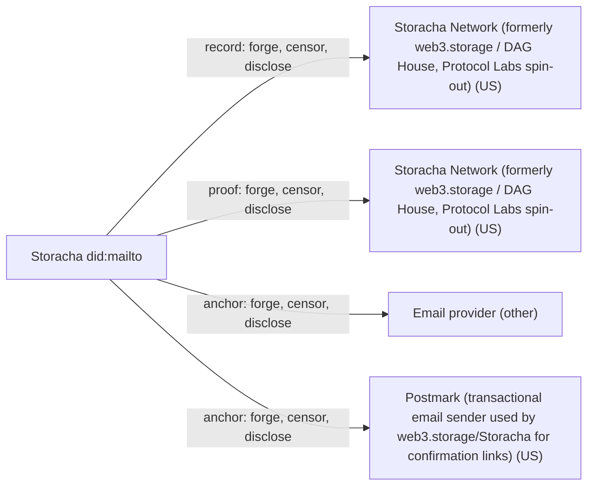

# Storacha did:mailto

## C1. Proof mechanism

Agent-side, the agent's did:key signs an access/authorize request naming a did:mailto account. Storacha (the oracle and authority) then emails a confirmation link. After the click, Storacha issues a delegation 'from' did:mailto with a zero-byte signature plus a ucan/attest signed by its own DID (https://github.com/storacha/specs/blob/main/w3-session.md, https://github.com/storacha/specs/blob/main/w3-account.md). A self-signed DKIM path is specified but was never implemented in w3up.

## C2. Verifier independence

The verifier never touches the email provider. It must trust the authority's attestation key (did:web:up.storacha.network), so in practice only Storacha's own service verified these links (https://github.com/storacha/specs/blob/main/w3-ucan.md).

## C3. Platform coverage and fragility

Email only. The email provider sees nothing special, so closing an API cannot break the flow. But anyone who controls the inbox (or the delivery path) can complete a login.

## C4. Key lifecycle

Account recovery is defined as 'just log in again with your email' (w3-account.md). Agent keys are disposable: each new key gets a new attestation, and revocation follows UCAN revocation of the enclosing delegation.

## C5. Freshness and replay

Attestations inherit the enclosing UCAN's nbf/exp. I found no handling of recycled or reassigned email addresses.

## C6. Threat model

The trust root is Storacha plus the email channel. Storacha alone can mint a valid did:mailto delegation, because the account signature is literally empty and only the attestation matters. The email provider, or the transactional mail sender (Postmark, per https://hackmd.io/@olizilla/SJ1B-okaj), can click the link.

## C7. Key system portability

The agent side is any did:key. The account side is fixed to did:mailto, which has no key of its own.

## C8. Adoption and status

Vendor specs (WIP) plus a did:mailto draft under ucan-wg. Storacha switched off writes on 2026-05-15 (https://github.com/storacha/w3infra/pull/636). By 2026-09-05 the upload/console hosts had no DNS and storacha.network redirected to fil.one (https://github.com/NiKrause/orbitdb-storage-bridge/blob/main/docs/STORACHA-SUNSET.md).

## C9. Effort tier

Migrate tier as deployed: you got the link only by becoming a Storacha account. Re-using it elsewhere means running your own w3up authority, which is build tier.

## C10. Sovereignty

One US operator (Storacha; its ToS is governed by Delaware law, https://web3.storage/docs/terms/) held the attester key, the stashed delegations and the email sender. That operator is now gone, so no new links can be made.

## Misfit notes

This is a hybrid of two families. In form it is capability delegation (UCAN from did:mailto to agent), but its security is pure issuer attestation after an email challenge. It is not OAuth, but it is the same shape as 'issuer attestation after login', with a magic link instead of OIDC. It also inverts the usual direction: the anchor (email) is the root principal and the key is the delegate, rather than a key claiming an account.

## Surprises

The did:mailto 'signature' on the delegation is zero bytes. All of the cryptographic weight sits in Storacha's ucan/attest, so the service can forge any account's delegation. The richer, self-verifiable DKIM-signed mode is in the spec but was never implemented. The whole deployment was switched off for writes in May 2026 and its hosts had disappeared by September 2026.

## Facts

| Fact | Value | Source | Date | Note |
|---|---|---|---|---|
| `proof.key_signs_claim` | yes | [link](https://github.com/storacha/specs/blob/main/w3-session.md) | 2026-01 | The agent signs an access/authorize invocation naming the did:mailto account it wants capabilities from. |
| `proof.anchor_publishes_key` | no | [link](https://github.com/storacha/specs/blob/main/w3-account.md) | 2026-01 | The deployed flow is a click on a link sent by email. The spec'd DKIM path (user emails 'I am also known as did:key') was never implemented in w3up. |
| `proof.third_party_signs_binding` | yes | [link](https://github.com/storacha/specs/blob/main/w3-ucan.md) | 2026-01 | The service authority (did:web:up.storacha.network) issues a ucan/attest for a did:mailto delegation carrying a zero-byte signature. |
| `proof.uses_oauth_oidc` | no | [link](https://github.com/storacha/specs/blob/main/w3-session.md) | 2026-01 | Uses a magic-link email confirmation (access/confirm), not OAuth/OIDC. |
| `proof.capability_delegation` | yes | [link](https://github.com/storacha/specs/blob/main/w3-session.md) | 2026-01 | The link is a UCAN delegation from the did:mailto account to the agent did:key, plus an attestation. |
| `proof.anchor_is_dns` | no | [link](https://github.com/storacha/specs/blob/main/w3-account.md) | 2026-01 | Only did:mailto is specified. |
| `proof.anchor_is_email` | yes | [link](https://github.com/storacha/specs/blob/main/did-mailto.md) | 2026-01 | did:mailto:domain:user encodes an email address as the account principal. |
| `proof.anchor_is_social` | no | [link](https://github.com/storacha/specs/blob/main/w3-account.md) | 2026-01 | Only email. |
| `verify.offline_possible` | yes | [link](https://github.com/storacha/specs/blob/main/w3-ucan.md) | 2026-01 | Given the delegation, the attestation and the authority's public key, the check is a signature plus time-bound check. Resolving did:web for the authority key would need a fetch. |
| `verify.fetches_anchor` | no | [link](https://github.com/storacha/specs/blob/main/w3-ucan.md) | 2026-01 | The verifier never contacts the email provider; it trusts the attestation instead. |
| `verify.needs_issuer_trust` | yes | [link](https://github.com/storacha/specs/blob/main/w3-account.md) | 2026-01 | 'A delegation signed with an attestation signature MUST be accompanied with a UCAN attestation issued by the trusted authority.' |
| `verify.needs_registry` | no | [link](https://github.com/storacha/specs/blob/main/w3-ucan.md) | 2026-01 | No registry lookup is needed to validate the attestation. Stashed delegations are fetched via access/claim, but that is retrieval, not verification. |
| `verify.no_author_service` | no | [link](https://github.com/NiKrause/orbitdb-storage-bridge/blob/main/docs/STORACHA-SUNSET.md) | 2026-09-23 | The attester is Storacha's did:web:up.storacha.network, and Storacha itself is the only defined verifier. As of 2026-09-05 the up/upload hosts have no DNS records. |
| `verify.breaks_if_api_closed` | no | [link](https://github.com/storacha/specs/blob/main/w3-session.md) | 2026-01 | The email provider exposes no API to the flow; plain SMTP delivery is all that is needed. |
| `lifecycle.survives_key_rotation` | no | [link](https://github.com/storacha/specs/blob/main/w3-session.md) | 2026-01 | The attestation is bound to one agent did:key; a new key needs a new email confirmation (the account identity survives, the link does not). |
| `lifecycle.explicit_revocation` | yes | [link](https://github.com/storacha/specs/blob/main/w3-ucan.md) | 2026-01 | 'The attestation MUST be considered revoked if the enclosing UCAN has been revoked' (UCAN revocation). |
| `lifecycle.expiry` | yes | [link](https://github.com/storacha/specs/blob/main/w3-ucan.md) | 2026-01 | Attestations are valid only within the enclosing UCAN's nbf/exp; the actual exp defaults used in production were not verified. |
| `lifecycle.key_recovery` | yes | [link](https://github.com/storacha/specs/blob/main/w3-account.md) | 2026-01 | 'Recovery is possible even if all devices have been lost as long as the user retains control of their email.' |
| `lifecycle.replay_protected` | unknown |  |  | UCAN nonce/exp apply, but no source found on how the system handles email reassignment or recycled addresses. |
| `record.transparency_log` | no | [link](https://github.com/storacha/specs/blob/main/w3-session.md) | 2026-01 | Delegations are stashed in Storacha's service storage, not an append-only public log. |
| `record.self_hosted_possible` | no | [link](https://github.com/storacha/specs/blob/main/w3-session.md) | 2026-01 | The deployed flow needs the trusted oracle/authority (Storacha) to send email and sign the attestation. The spec allows other authorities, but none was deployed. |
| `record.multi_operator` | no | [link](https://github.com/storacha/w3infra) | 2026-05 | A single w3infra deployment run by Storacha. |
| `portability.generic_key` | yes | [link](https://github.com/storacha/specs/blob/main/w3-session.md) | 2026-01 | The agent is any did:key (ed25519 in practice). |
| `portability.extensible_anchors` | no | [link](https://github.com/storacha/specs/blob/main/w3-account.md) | 2026-01 | Only did:mailto is defined. The spec says implementations may extend to other DID methods, but each needs a new method and oracle flow. |
| `adoption.spec_maturity` | 1 | [link](https://github.com/storacha/specs/blob/main/did-mailto.md) | 2026-01 | did:mailto is a draft with 'no official standing of any kind'; w3-account is marked WIP and is vendor-authored. |
| `adoption.active_2026` | yes | [link](https://github.com/storacha/specs/commits/main) | 2026-01-26 | Spec commits in Jan 2026, and the WRITES_DISABLED change was merged 2026-05-15. 'Active' here includes the shutdown. |
| `adoption.client_display` | no | [link](https://github.com/NiKrause/orbitdb-storage-bridge/blob/main/docs/STORACHA-SUNSET.md) | 2026-09-23 | The console showed account email, but the console/upload hosts are gone as of 2026-09-05 and storacha.network redirects to fil.one. |
| `effort.attachable` | no | [link](https://github.com/storacha/specs/blob/main/w3-session.md) | 2026-01 | The link only exists inside the Storacha authority's UCAN domain; you cannot attach it to your own key system without running your own authority (build tier). |
| `effort.requires_platform_migration` | yes | [link](https://github.com/storacha/specs/blob/main/w3-account.md) | 2026-01 | As deployed, the email-to-key link was only obtainable as a Storacha account; the service is now decommissioned. |

## Sovereignty

## Operators

| Layer | Operator | Forge | Censor | Disclose | Note |
|---|---|---|---|---|---|
| record | Storacha Network (formerly web3.storage / DAG House, Protocol Labs spin-out) (US) | yes | yes | yes | Storacha stashes the account's delegations (access/claim). It can mint a zero-byte-signature did:mailto delegation plus its own ucan/attest. |
| proof | Storacha Network (formerly web3.storage / DAG House, Protocol Labs spin-out) (US) | yes | yes | yes | Storacha signs the ucan/attest that carries all the cryptographic weight; it can refuse to attest and now no longer can (service decommissioned). |
| anchor | Email provider (other) | yes | yes | yes | Mailbox control means it can click the confirmation link; it can drop the email; it holds mail logs. |
| anchor | Postmark (transactional email sender used by web3.storage/Storacha for confirmation links) (US) | yes | yes | yes | The sender sees the confirmation URL in transit; it could follow it or drop the mail. Based on a 2023 planning note. |
